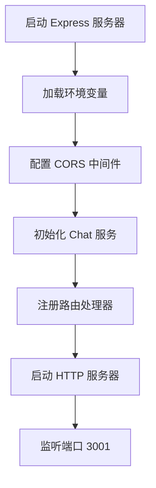
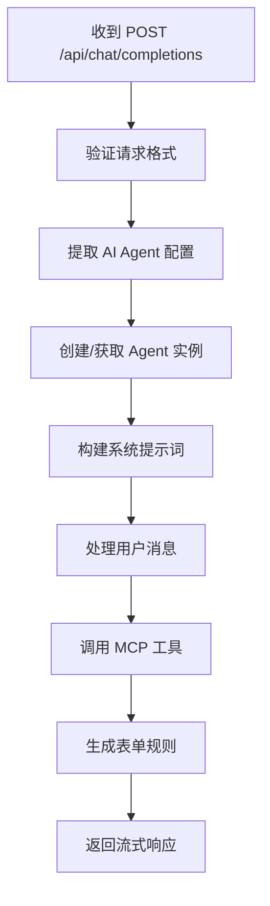
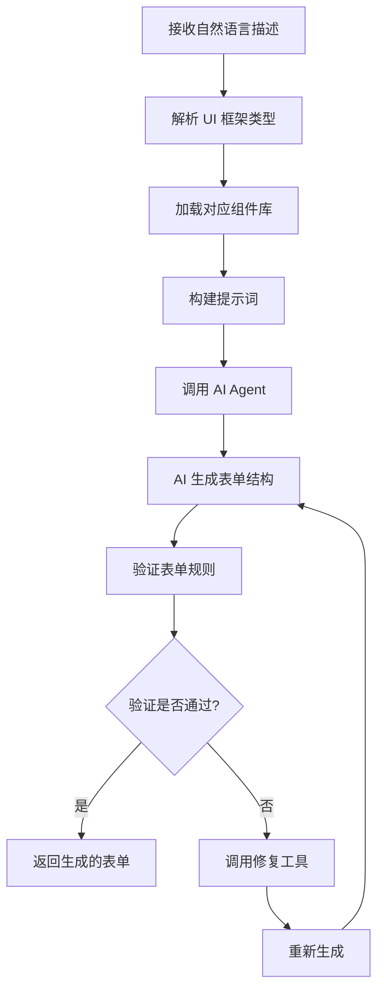
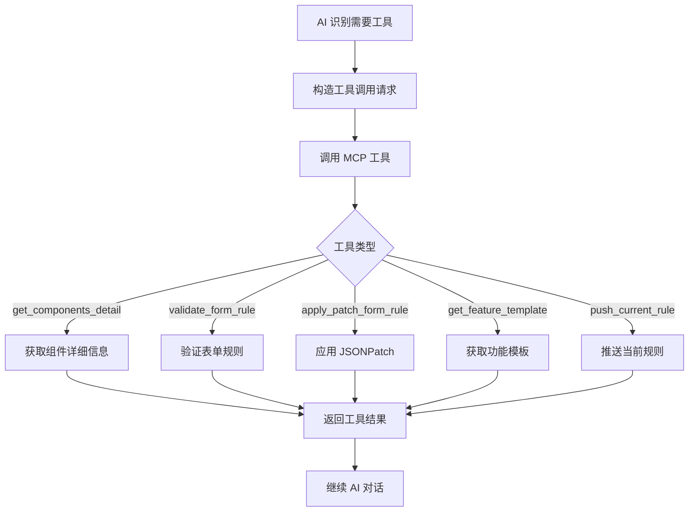

# AI 表单助理 - 项目技术文档

## 项目概述

AI 表单助理是一个基于人工智能的表单生成和修改系统，能够根据自然语言描述自动生成和修改表单规则。项目支持多种主流 UI 框架和 AI 服务提供商，采用 TypeScript 开发，提供完整的 RESTful API 接口。

### 核心特性
- 🤖 **多 AI 服务支持** - DeepSeek、智谱AI、通义千问及自定义 OpenAI 兼容接口
- 🎨 **多 UI 框架** - Element Plus/UI、Ant Design Vue、Vant、银海TA404-UI
- 📝 **智能表单生成** - 根据自然语言描述自动生成完整的表单规则
- 🔧 **表单验证与修复** - 自动验证表单规则并提供修复建议
- 🔄 **增量更新** - 支持基于 JSONPatch 的精确表单规则修改
- 📱 **移动端支持** - 支持 Vant 移动端表单生成

## 项目目录结构

```
ai-assistant/
├── src/                          # 源代码目录
│   ├── components/               # UI 组件定义
│   │   ├── element-plus/         # Element Plus 组件
│   │   │   ├── vue2/            # Vue2 版本组件
│   │   │   ├── vue3/            # Vue3 版本组件
│   │   │   ├── common/          # 通用组件定义
│   │   │   ├── index.ts         # 组件导出
│   │   │   ├── vue2.ts          # Vue2 组件集合
│   │   │   └── vue3.ts          # Vue3 组件集合
│   │   ├── ant-design-vue/      # Ant Design Vue 组件
│   │   │   ├── vue2/
│   │   │   ├── vue3/
│   │   │   ├── common/
│   │   │   └── index.ts
│   │   ├── vant/               # Vant 移动端组件
│   │   │   ├── vue2/
│   │   │   ├── vue3/
│   │   │   └── index.ts
│   │   ├── ta404-ui/           # 银海 TA404-UI 组件
│   │   │   ├── vue2/
│   │   │   └── index.ts
│   │   ├── common/             # 通用组件定义
│   │   │   ├── tools/          # 通用工具
│   │   │   │   ├── form/       # 表单相关工具
│   │   │   │   │   ├── features/    # 功能模块
│   │   │   │   │   │   ├── validate/ # 验证功能
│   │   │   │   │   │   ├── computed/ # 计算属性
│   │   │   │   │   │   ├── control/  # 控制功能
│   │   │   │   │   │   └── event/    # 事件功能
│   │   │   │   │   └── handlers/     # 处理器
│   │   │   │   │       ├── validate-form-rule-tool.ts
│   │   │   │   │       ├── get-components-detail-tool.ts
│   │   │   │   │       ├── get-feature-template-tool.ts
│   │   │   │   │       ├── push-current-rule-tool.ts
│   │   │   │   │       └── apply-patch-form-rule-tool.ts
│   │   │   │   └── form-validator.ts
│   │   │   └── index.ts
│   │   └── index.ts            # 组件统一导出
│   ├── core/                    # 核心功能模块
│   │   ├── component-registry.ts    # 组件注册表
│   │   ├── form-rule-generator.ts   # 表单规则生成器
│   │   └── json-patch-validator.ts  # JSONPatch 验证器
│   ├── service/                # 服务层
│   │   ├── agent/             # AI Agent 实现
│   │   │   ├── base.ts        # 基础 Agent 类
│   │   │   ├── deepseek.ts    # DeepSeek Agent
│   │   │   ├── zhipu.ts       # 智谱AI Agent
│   │   │   ├── qwen.ts        # 通义千问 Agent
│   │   │   ├── other.ts       # 自定义 Agent
│   │   │   ├── dify.ts        # Dify Agent
│   │   │   └── index.ts       # Agent 统一导出
│   │   ├── chat.ts           # 聊天服务核心
│   │   ├── index.ts          # Express 服务器入口
│   │   ├── agent-manager.ts  # Agent 管理器
│   │   ├── message-processor.ts # 消息处理器
│   │   ├── prompt-builder.ts  # 提示词构建器
│   │   └── tools.ts          # MCP 工具注册
│   ├── types/                 # TypeScript 类型定义
│   │   └── index.ts
│   ├── utils/                 # 工具函数
│   │   ├── index.ts
│   │   └── logger.ts          # 日志工具
│   └── service/              # 服务层（重复，可能是历史遗留）
├── dist/                      # 编译输出目录
├── log/                       # 日志文件目录
├── ai-panel/                  # 前端面板
├── package.json               # 项目配置
├── tsconfig.json             # TypeScript 配置
├── README.md                 # 项目说明文档
└── .env                      # 环境变量配置
```

## 核心文件功能详解

### 1. 入口文件
- **`src/service/index.ts`** - Express 服务器主入口，负责：
  - 加载环境变量和配置
  - 配置 CORS 中间件
  - 注册路由处理器
  - 启动 HTTP 服务器（默认端口 3001）

### 2. 核心服务类
- **`src/service/chat.ts`** - 聊天服务核心类，负责：
  - 处理 OpenAI 兼容的 Chat Completions API 请求
  - 管理 AI Agent 和工具注册
  - 实现流式响应
  - 消息格式转换和处理

### 3. 组件注册与管理
- **`src/core/component-registry.ts`** - 组件注册表核心类：
  - 管理所有 UI 框架的组件定义
  - 提供组件查询和检索功能
  - 支持组件分类和标签管理
  - 集成框架特定工具

### 4. AI Agent 管理
- **`src/service/agent-manager.ts`** - AI Agent 管理器：
  - 创建和缓存 AI Agent 实例
  - 支持多种 AI 服务提供商
  - 管理 API 密钥和模型配置

### 5. 组件定义目录
- **`src/components/`** - UI 组件定义目录：
  - 按 UI 框架分类组织
  - 支持 Vue2 和 Vue3 版本
  - 包含组件属性、事件、示例定义
  - 提供框架特定的功能扩展

## 核心函数详解

### 1. Chat 类 (`src/service/chat.ts`)

#### 主要方法：

```typescript
// 处理流式聊天请求
async streamChat(request: ChatRequest): Promise<AsyncIterable<string>>

// 处理单次聊天请求
async chat(request: ChatRequest): Promise<OpenAIChatStreamChunk>

// 获取 UI 版本信息
private getUiVersion(ui: string): { framework: string; vueVersion: string }

// 转换消息格式
private convertToAgentMessages(messages: OpenAIMessage[]): AgentMessage[]
```

### 2. ComponentRegistry 类 (`src/core/component-registry.ts`)

#### 主要方法：

```typescript
// 注册组件
registerComponent(type: string, component: ComponentInfo): void

// 获取所有组件
getAllComponents(): Map<string, ComponentInfo[]>

// 根据类型获取组件
getComponent(type: string): ComponentInfo | undefined

// 获取框架组件
getFrameworkComponents(framework: string): ComponentInfo[]

// 注册工具
registerTool(name: string, registration: ToolRegistration): void

// 获取工具
getTool(name: string): ToolRegistration | undefined
```

### 3. FormRuleGenerator 类 (`src/core/form-rule-generator.ts`)

#### 主要方法：

```typescript
// 生成表单规则
generateRule(description: string, uiFramework: string): Promise<any>

// 验证表单规则
validateRule(rule: any[]): ValidateDetails

// 应用 JSONPatch 补丁
applyPatch(originalRule: any[], patch: JsonPatch[]): any[]
```

### 4. AgentManager 类 (`src/service/agent-manager.ts`)

#### 主要方法：

```typescript
// 获取或创建 Agent
getAgent(agentType: AgentType, apiKey: string, model: string): BaseAgent

// 清理缓存
clearCache(): void

// 获取缓存大小
getCacheSize(): number
```

## 核心工作流程

### 1. 服务启动流程



### 2. API 请求处理流程



### 3. 表单生成工作流程



### 4. 组件工具调用流程



## 技术架构

### 1. 分层架构

- **展示层（Presentation Layer）**: Express.js HTTP 服务器
- **应用层（Application Layer）**: Chat 服务、路由处理
- **领域层（Domain Layer）**: 组件注册表、表单生成器、Agent 管理器
- **基础设施层（Infrastructure Layer）**: AI Agent 实现、工具处理器

### 2. 核心设计模式

- **工厂模式**: Agent 创建（`createAgent` 函数）
- **注册表模式**: 组件注册表、工具注册表
- **策略模式**: 多种 AI Agent 实现
- **观察者模式**: 事件处理机制
- **建造者模式**: 提示词构建器

### 3. 数据流架构

```
用户请求 → Express 路由 → Chat 服务 → Agent 管理器 → AI 服务提供商
                                                  ↓
响应流 ← SSE ← 消息处理器 ← 工具注册表 ← 组件注册表
```

## API 接口详解

### 1. 主要端点

#### `POST /api/chat/completions`
- **功能**: 处理聊天请求并生成表单规则
- **请求格式**: OpenAI Chat Completions API 兼容
- **响应格式**: Server-Sent Events (SSE) 流式响应

#### `GET /api/health`
- **功能**: 健康检查
- **响应**: 服务状态信息

### 2. 请求参数

```typescript
interface ChatRequest {
  model: string;           // AI 模型名称
  agent: AgentType;       // AI 服务提供商类型
  ui: string;             // UI 框架类型
  messages: OpenAIMessage[]; // 对话消息
  form?: {                // 现有表单（修改时提供）
    rule?: string;
    option?: string;
  };
}
```

### 3. 响应格式

```typescript
interface OpenAIChatStreamChunk {
  id: string;
  object: 'formCreateAgent';
  created: number;
  choices: [{
    index: number;
    delta: {
      role?: 'assistant';
      content?: string;
    };
    finish_reason: string | null;
  }];
}
```

## 配置管理

### 环境变量配置

```bash
# 服务配置
PORT=3001                    # 服务端口
DEFAULT_AGENT=deepseek       # 默认 Agent 类型
DEFAULT_MODEL=deepseek-chat  # 默认模型

# AI 服务配置
DEFAULT_TOKEN=xxx            # 默认 API 密钥
AGENT_API=xxx               # 自定义 Agent API 端点
AGENT_TIMEOUT=180000        # 请求超时时间

# 功能配置
FORM_CREATE_BUSINESS=false   # 是否为高级版
```

## 扩展开发指南

### 1. 添加新的 UI 框架

1. 创建组件目录: `src/components/new-framework/`
2. 定义组件文件: `vue2/index.ts`, `vue3/index.ts`
3. 更新组件注册: `src/core/component-registry.ts`
4. 添加框架检测: `src/service/chat.ts`

### 2. 添加新的 AI Agent

1. 实现基础接口: `src/service/agent/base.ts`
2. 创建具体实现: `src/service/agent/new-agent.ts`
3. 更新工厂函数: `src/service/agent/index.ts`
4. 注册 Agent 类型

### 3. 添加新的 MCP 工具

1. 定义工具接口: `src/types/index.ts`
2. 实现工具处理器: `src/components/common/tools/`
3. 注册工具: `src/service/tools.ts`

## 部署说明

### 开发环境

```bash
# 安装依赖
pnpm install

# 启动开发服务
pnpm start
```

### 生产环境

```bash
# 编译 TypeScript
pnpm build

# 启动编译后的服务
pnpm start:build
```

### Docker 部署

```bash
# 构建镜像
docker build -t ai-assistant .

# 运行容器
docker run -p 3001:3001 ai-assistant
```

## 总结

AI 表单助理项目采用了清晰的分层架构和模块化设计，通过组件注册表模式实现了多 UI 框架的统一管理，使用 MCP（Model Context Protocol）工具协议扩展 AI 能力。项目具有良好的可扩展性，支持轻松添加新的 UI 框架、AI 服务和功能工具。

核心工作流程围绕表单生成和修改展开，通过 AI Agent 与工具系统的协作，实现了从自然语言描述到结构化表单规则的智能转换。