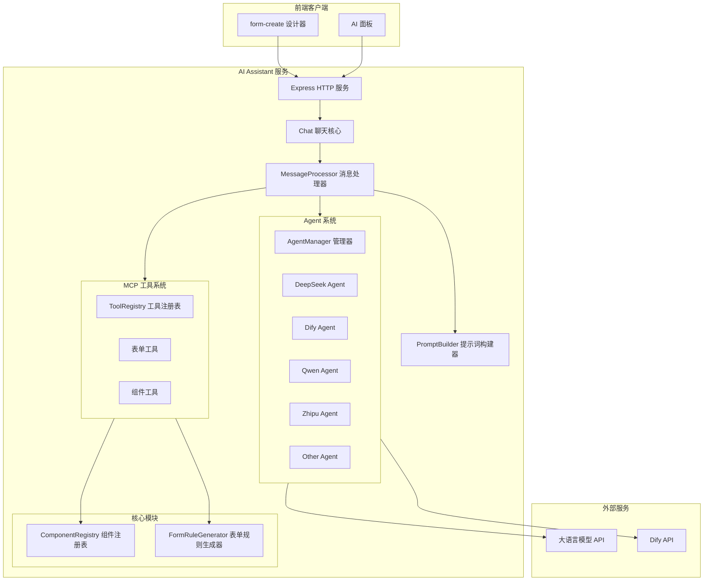
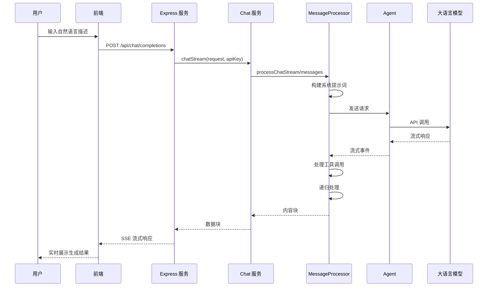
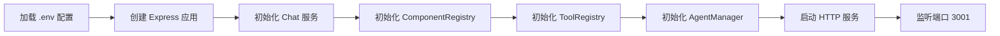

# 项目架构概览

## 1. 系统概述

AI Assistant 是一个基于 MCP (Model Context Protocol) 的智能表单生成助手，它能够理解自然语言描述并自动生成符合规范的表单规则。本节将从整体架构角度介绍系统的核心设计理念和模块划分。

### 1.1 系统定位

AI Assistant 主要服务于 form-create 设计器，提供以下核心能力：

- **自然语言生成表单**：用户通过自然语言描述需求，系统自动生成表单规则
- **多UI框架支持**：支持 Element Plus、Ant Design Vue、Vant、ta404-ui 等主流 Vue UI 框架
- **智能表单验证**：自动验证生成的表单规则，提供修复建议
- **增量更新机制**：支持对现有表单进行局部修改，而非全量重建

### 1.2 技术栈概览

| 层级 | 技术选型 | 用途 |
|------|---------|------|
| 运行时 | Node.js 18+ | 服务端运行环境 |
| 框架 | Express 5.x | Web 服务框架 |
| 类型系统 | TypeScript 5.x | 类型安全和代码可维护性 |
| AI 协议 | MCP SDK | 模型上下文协议实现 |
| JSON 处理 | fast-json-patch | JSON Patch 操作支持 |
| 表单验证 | Zod | Schema 验证 |
| UI 框架 | Vue 2/3 | 多版本兼容 |

## 2. 系统架构图



## 3. 前后端交互流程

### 3.1 请求处理流程

当用户通过前端发送请求时，系统遵循以下处理流程：



### 3.2 核心交互代码示例

**请求入口** (`src/service/index.ts`):

```typescript
// Express 路由处理
app.post('/api/chat/completions', async (req: Request, res: Response) => {
    // 提取请求参数
    const params = { ...req.body };
    const apiKey = req.headers.authorization?.substring(7);
    
    // 调用聊天服务
    for await (const chunk of service.chatStream(params, apiKey, controller.signal)) {
        res.write(service.generateStreamChunk(content, isFirst, false, params.model));
        isFirst = false;
    }
    res.write('data: [DONE]\n\n');
    res.end();
});
```

**聊天核心服务** (`src/service/chat.ts`):

```typescript
export default class Chat {
    private toolRegistry: ToolRegistry;
    private formGenerator: FormRuleGenerator;
    private componentRegistry: ComponentRegistry;
    private agentManager: AgentManager;
    private messageProcessor: MessageProcessor;
    private promptBuilder: PromptBuilder;

    constructor() {
        this.componentRegistry = new ComponentRegistry();
        this.toolRegistry = new ToolRegistry(this.componentRegistry);
        this.formGenerator = new FormRuleGenerator();
        this.agentManager = new AgentManager();
        this.promptBuilder = new PromptBuilder(this.componentRegistry);
        this.messageProcessor = new MessageProcessor(
            this.toolRegistry, this.formGenerator, 
            this.componentRegistry, this.agentManager
        );
    }

    async *chatStream(request: ChatRequest, apiKey: string, signal: AbortSignal) {
        // 获取 Agent 类型
        const agentType = request.agent || 'deepseek';
        
        // 动态获取 MCP 工具
        const tools = await this.messageProcessor.getMCPTools(request.ui);
        
        // 构建消息
        const messages = this.convertToAgentMessages(request.messages);
        
        // 处理流式对话
        yield* this.messageProcessor.processChatStream(
            messages, apiKey, request.model, tools, agentType,
            1, request.context, currentSessionId, signal, request.ui
        );
    }
}
```

## 4. 核心模块划分

### 4.1 模块职责说明

| 模块 | 文件路径 | 核心职责 |
|------|---------|---------|
| **Chat** | `src/service/chat.ts` | 对外提供聊天接口，生成 OpenAI 兼容响应 |
| **MessageProcessor** | `src/service/message-processor.ts` | 处理消息流，递归调用 Agent，支持工具调用 |
| **AgentManager** | `src/service/agent-manager.ts` | 管理 Agent 实例缓存，支持多模型切换 |
| **ComponentRegistry** | `src/core/component-registry.ts` | 组件注册与查询，管理多 UI 框架组件 |
| **FormRuleGenerator** | `src/core/form-rule-generator.ts` | 表单规则验证与改进 |
| **PromptBuilder** | `src/service/prompt-builder.ts` | 构建系统提示词，组装组件列表 |
| **ToolRegistry** | `src/service/tools.ts` | MCP 工具注册与管理 |

### 4.2 组件注册模块详解

组件注册表是系统的核心模块之一，负责管理所有支持的 UI 框架组件：

```typescript
// src/core/component-registry.ts
export class ComponentRegistry {
    private components: Map<string, ComponentInfo[]> = new Map();
    private tools: Map<string, ToolRegistration> = new Map();
    private frameworkTools: Map<string, Map<string, ToolRegistration>> = new Map();

    constructor() {
        this.initializeComponents();
        this.initializeTools();
    }

    private initializeComponents() {
        // 注册各 UI 框架组件
        elementPlusComponents.forEach((c) => this.registerComponent(c.type, c));
        antDesignVueComponents.forEach((c) => this.registerComponent(c.type, c));
        vantComponents.forEach((c) => this.registerComponent(c.type, c));
        ta404uiVue2Components.forEach((c) => this.registerComponent(c.type, c));
    }

    // 获取组件信息（支持框架版本匹配）
    getComponent(type: string, uiFramework: string, vueVersion: 'vue2' | 'vue3' = 'vue3') {
        const components = this.components.get(type);
        const detectedFramework = this.detectFramework(uiFramework, vueVersion);
        
        // 优先完全匹配，其次兼容版本，最后通用组件
        return components.find(
            comp => comp.uiFramework === detectedFramework && comp.vueVersion === vueVersion
        ) || components.find(
            comp => comp.uiFramework === 'common' && comp.vueVersion === 'common'
        );
    }

    // 组件分类
    categorizeComponents(components: ComponentInfo[]) {
        return {
            formComponents: { /* 表单组件 */ },
            layoutComponents: { /* 布局组件 */ },
            inputComponents: { /* 输入组件 */ },
            selectComponents: { /* 选择组件 */ },
            dateComponents: { /* 日期组件 */ },
            displayComponents: { /* 展示组件 */ },
            assistComponents: { /* 辅助组件 */ },
        };
    }
}
```

### 4.3 文件目录结构

```
ai-assistant/
├── src/
│   ├── service/                    # 服务层
│   │   ├── index.ts               # Express 入口
│   │   ├── chat.ts                # 聊天核心
│   │   ├── agent-manager.ts       # Agent 管理
│   │   ├── message-processor.ts   # 消息处理
│   │   ├── prompt-builder.ts      # 提示词构建
│   │   ├── tools.ts               # 工具注册
│   │   └── agent/                 # Agent 实现
│   │       ├── index.ts
│   │       ├── base.ts
│   │       ├── deepseek.ts
│   │       ├── dify.ts
│   │       ├── qwen.ts
│   │       ├── zhipu.ts
│   │       └── other.ts
│   ├── core/                       # 核心模块
│   │   ├── component-registry.ts  # 组件注册
│   │   └── form-rule-generator.ts # 表单规则生成
│   ├── components/                 # 组件定义
│   │   ├── element-plus/
│   │   ├── ant-design-vue/
│   │   ├── vant/
│   │   ├── ta404-ui/
│   │   └── common/
│   │       └── tools/
│   │           └── form/          # 表单工具
│   └── types/                      # 类型定义
├── dist/                           # 构建输出
├── docs/                           # 文档
├── Dockerfile
├── .env.example
└── package.json
```

## 5. 配置与环境

### 5.1 环境变量配置

系统支持通过 `.env` 文件进行配置：

```bash
# 服务器配置
PORT=3001

# Agent API 配置
AGENT_API=https://api.deepseek.com/v1/chat/completions
AGENT_TIMEOUT=180000

# 默认 Agent 设置
DEFAULT_AGENT_KEY_TYPE=openai
DEFAULT_AGENT=deepseek
DEFAULT_MODEL=deepseek-chat

# 功能开关
FORM_CREATE_BUSINESS=false
```

### 5.2 服务启动流程



## 6. 小结

本节介绍了 AI Assistant 的整体架构设计：

1. **分层架构**：表现层 → 服务层 → 核心层 → 外部服务
2. **模块化设计**：各模块职责清晰，便于维护和扩展
3. **多框架支持**：通过 ComponentRegistry 实现统一的组件管理接口
4. **流式处理**：全程采用流式响应，提供良好的用户体验
5. **工具驱动**：基于 MCP 协议实现可扩展的工具系统

后续章节将详细介绍各个核心模块的具体实现。
