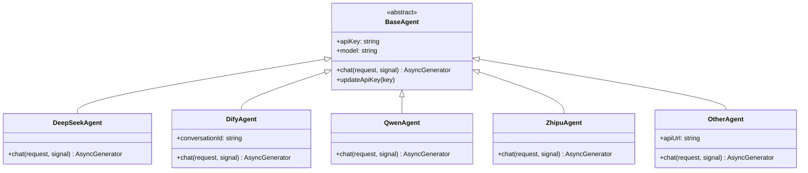
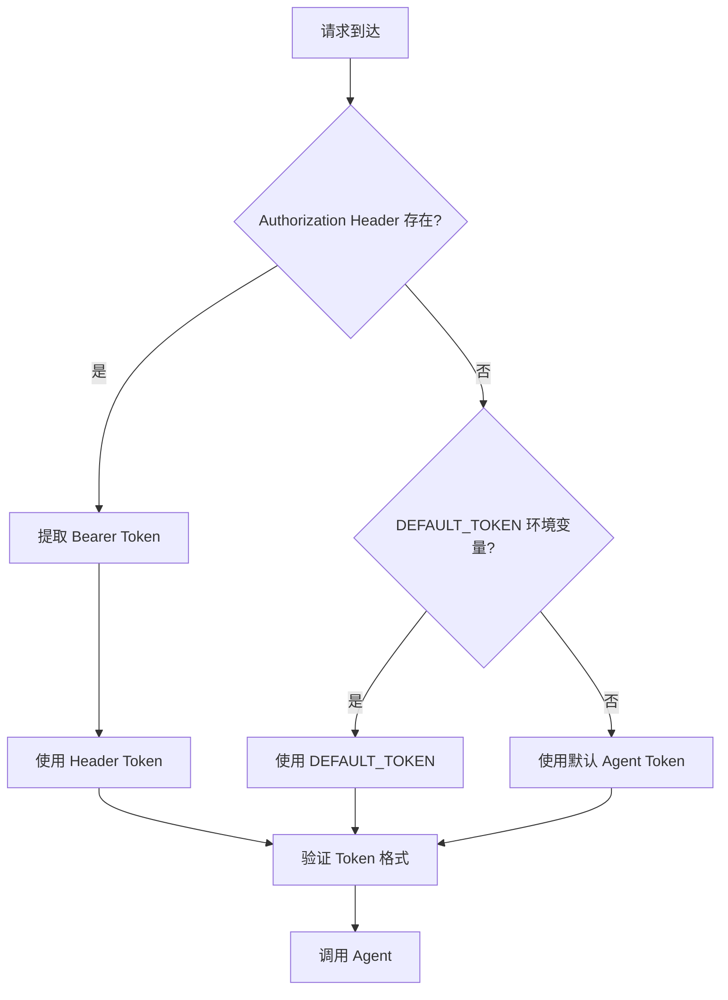

# AI Agent 系统

## 1. 技术原理

### 1.1 Agent 模式概述

AI Assistant 采用 **Agent 模式** 实现与各大语言模型的对接。Agent 是大语言模型与外部工具、系统之间的桥梁，负责：

- **请求转发**：将用户请求转换为模型可理解的格式
- **响应处理**：解析模型返回的流式响应
- **工具调用管理**：协调模型发起的工具调用
- **状态维护**：管理对话上下文和会话状态

### 1.2 多模型支持架构

系统设计了统一的 Agent 接口，支持无缝切换不同的模型提供商：



### 1.3 OpenAI 兼容接口

所有 Agent 实现都遵循 OpenAI Chat Completions API 规范：

```typescript
// OpenAI 兼容的消息格式
interface OpenAIMessage {
    role: 'system' | 'user' | 'assistant' | 'tool';
    content: string;
    tool_call_id?: string;
    tool_calls?: Array<{
        id: string;
        type: 'function';
        function: {
            name: string;
            arguments: string;
        };
    }>;
}

// OpenAI 兼容的请求格式
interface ChatRequest {
    model: string;
    ui: string;
    messages: OpenAIMessage[];
    agent?: AgentType;
    context: Record<string, any>;
    conversation_id: string;
}
```

## 2. 项目中的实际用例

### 2.1 Agent 管理器

AgentManager 负责创建、缓存和管理 Agent 实例：

```typescript
// src/service/agent-manager.ts
import { AgentType, BaseAgent, createAgent } from './agent/index.js';

export class AgentManager {
    private agentCache: Map<string, BaseAgent> = new Map();

    /**
     * 获取或创建 Agent
     * 使用缓存避免重复创建相同配置的 Agent
     */
    getAgent(agentType: AgentType, apiKey: string, model: string): BaseAgent {
        const cacheKey = `${agentType}-${model}`;
        
        if (!this.agentCache.has(cacheKey)) {
            const agent = createAgent(agentType, apiKey, model);
            this.agentCache.set(cacheKey, agent);
            console.log(`✅ 创建 ${agentType} Agent: ${model}`);
        } else {
            // 更新 API 密钥
            const agent = this.agentCache.get(cacheKey)!;
            agent.updateApiKey(apiKey);
        }
        
        return this.agentCache.get(cacheKey)!;
    }

    /**
     * 清理所有 Agent 缓存
     */
    clearCache(): void {
        this.agentCache.clear();
    }

    /**
     * 获取缓存的 Agent 数量
     */
    getCacheSize(): number {
        return this.agentCache.size;
    }
}
```

### 2.2 DeepSeek Agent 实现

DeepSeek Agent 是默认使用的 Agent 实现：

```typescript
// src/service/agent/deepseek.ts
import { BaseAgent, AgentRequest } from './base.js';
import axios, { AxiosInstance } from 'axios';

export class DeepSeekAgent extends BaseAgent {
    private client: AxiosInstance;

    constructor(apiKey: string, model: string = 'deepseek-chat') {
        super(apiKey, model);
        this.client = axios.create({
            baseURL: process.env.AGENT_API || 'https://api.deepseek.com/v1/chat/completions',
            timeout: parseInt(process.env.AGENT_TIMEOUT || '180000'),
            headers: {
                'Content-Type': 'application/json',
                'Authorization': `Bearer ${apiKey}`,
            },
        });
    }

    /**
     * 发送聊天请求，支持流式响应
     */
    async *chat(request: AgentRequest, signal?: AbortSignal): AsyncGenerator<Buffer, void, unknown> {
        const response = await this.client.post('', {
            model: this.model,
            messages: request.messages,
            stream: true,
            stream_options: request.stream_options,
            temperature: request.temperature,
            max_tokens: request.max_tokens,
            tools: request.tools,
            tool_choice: request.tool_choice,
        }, {
            signal,
            responseType: 'stream',
        });

        for await (const chunk of response.data) {
            yield chunk;
        }
    }
}
```

### 2.3 Dify Agent 实现

Dify Agent 专门处理 Dify 平台的请求：

```typescript
// src/service/agent/dify.ts
import { BaseAgent, AgentRequest } from './base.js';
import axios, { AxiosInstance } from 'axios';

export class DifyAgent extends BaseAgent {
    private client: AxiosInstance;
    private conversationId: string = '';

    constructor(apiKey: string, model?: string) {
        super(apiKey, model);
        this.client = axios.create({
            baseURL: process.env.DIFY_API_URL || 'http://localhost:8000/v1',
            timeout: parseInt(process.env.AGENT_TIMEOUT || '180000'),
            headers: {
                'Content-Type': 'application/json',
                'Authorization': `Bearer ${apiKey}`,
            },
        });
    }

    /**
     * Dify 流式聊天请求
     */
    async *chat(request: AgentRequest, signal?: AbortSignal): AsyncGenerator<Buffer, void, unknown> {
        const response = await this.client.post('/chat-messages', {
            query: request.query,
            response_mode: 'streaming',
            conversation_id: request.conversation_id || this.conversationId,
            user: request.user || 'user',
            inputs: request.inputs || {},
            files: request.files || [],
            auto_generate_name: true,
        }, {
            signal,
            responseType: 'stream',
        });

        for await (const chunk of response.data) {
            yield chunk;
        }
    }
}
```

### 2.4 Agent 工厂函数

统一的 Agent 创建入口：

```typescript
// src/service/agent/index.ts
import { BaseAgent } from './base.js';
import { DifyAgent } from './dify.js';
import { DeepSeekAgent } from './deepseek.js';
import { ZhipuAgent } from './zhipu.js';
import { QwenAgent } from './qwen.js';
import { OtherAgent } from './other.js';

export type AgentType = 'dify' | 'deepseek' | 'zhipu' | 'qwen' | 'other';

/**
 * Agent 工厂函数
 * 根据类型创建对应的 Agent 实例
 */
export function createAgent(type: AgentType, apiKey: string, model?: string): BaseAgent {
    switch (type) {
        case 'dify':
            return new DifyAgent(apiKey, model);
        case 'deepseek':
            return new DeepSeekAgent(apiKey, model);
        case 'zhipu':
            return new ZhipuAgent(apiKey, model);
        case 'qwen':
            return new QwenAgent(apiKey, model);
        case 'other':
            return new OtherAgent(apiKey, model);
        default:
            throw new Error(`未知的 Agent 类型: ${type}`);
    }
}
```

### 2.5 消息处理器中的 Agent 调用

```typescript
// src/service/message-processor.ts
async *processChatStream(
    messages: AgentMessage[],
    apiKey: string,
    model: string,
    tools: AgentTool[],
    agentType: AgentType,
    maxDepth: number = 1,
    context: Record<string, any>,
    sessionId?: string,
    signal?: AbortSignal,
    uiFramework?: string,
): AsyncGenerator<string | { content: string; usage?: any }> {
    // 获取或创建 Agent
    const agent = this.agentManager.getAgent(agentType, apiKey, model);

    // 构建请求
    const agentRequest: AgentRequest = {
        model,
        messages,
        stream: true,
        stream_options: { include_usage: true },
        temperature: 0.2,
        tool_stream: true,
        parallel_tool_calls: true,
        max_tokens: 4000,
        tools,
        tool_choice: 'auto',
    };

    // 发送请求
    const response = await agent.chat(agentRequest, signal);

    // 处理流式响应...
}
```

## 3. API 密钥管理策略

### 3.1 密钥获取流程



### 3.2 密钥配置示例

```bash
# .env 文件配置

# 方式1: 使用默认 Token（推荐用于生产环境）
DEFAULT_TOKEN=sk-your-deepseek-api-key

# 方式2: 通过请求头传递（适合多用户场景）
# 请求时设置: Authorization: Bearer sk-your-api-key

# Dify 特殊配置
DIFY_API_URL=http://your-dify-server/v1
DIFY_API_KEY=app-xxxxxxxxxxxx
```

### 3.3 密钥安全最佳实践

```typescript
// 请求处理中的密钥验证
app.post('/api/chat/completions', async (req, res) => {
    const authHeader = req.headers.authorization;
    
    // 优先级: 请求头 > 环境变量
    const apiKey = authHeader && authHeader.startsWith('Bearer ')
        ? authHeader.substring(7)
        : process.env.DEFAULT_TOKEN;
    
    if (!apiKey) {
        return res.status(401).json({
            error: {
                message: 'API 密钥未配置',
                type: 'authentication_error',
                code: 'missing_api_key',
            },
        });
    }
    
    // 记录请求（不记录完整密钥）
    console.log('🔑 使用 API 密钥:', apiKey.substring(0, 10) + '...');
});
```

### 3.4 模型切换示例

```typescript
// 请求时指定使用的 Agent 和模型
const request = {
    agent: 'deepseek',      // Agent 类型
    model: 'deepseek-chat', // 模型名称
    messages: [...],
};

// 支持的 Agent 类型
const SUPPORTED_AGENTS = ['deepseek', 'dify', 'qwen', 'zhipu', 'other'];

// 配置其他兼容 OpenAI 接口的模型
if (agent === 'other') {
    // 通过 AGENT_API 环境变量指定自定义接口
    process.env.AGENT_API = 'https://api.openai.com/v1/chat/completions';
}
```

## 4. 错误处理机制

### 4.1 API 错误处理

```typescript
async function handleAgentError(error: any): Promise<string> {
    if (axios.isAxiosError(error)) {
        const status = error.response?.status;
        
        switch (status) {
            case 401:
                return '❌ API 认证失败 (401): 请检查 API 密钥是否正确';
            case 429:
                return '❌ API 请求频率限制 (429): 请稍后再试';
            case 400:
                return `❌ API 请求错误 (400): ${error.response?.data?.error?.message}`;
            case 500:
                return '❌ 服务器内部错误 (500): 服务器出现问题';
            default:
                return `❌ API 错误 (${status}): ${error.message}`;
        }
    }
    return `❌ 系统错误: ${error.message}`;
}
```

## 5. 小结

本节介绍了 AI Agent 系统的核心设计：

1. **多 Agent 支持**：通过统一的接口和工厂模式支持多种模型
2. **缓存机制**：AgentManager 实现实例缓存，避免重复创建
3. **OpenAI 兼容**：遵循 OpenAI API 规范，便于集成
4. **密钥管理**：支持请求头和环境变量两种配置方式
5. **完善的错误处理**：针对不同错误码提供友好的错误信息

下一章将详细介绍组件库架构设计。
