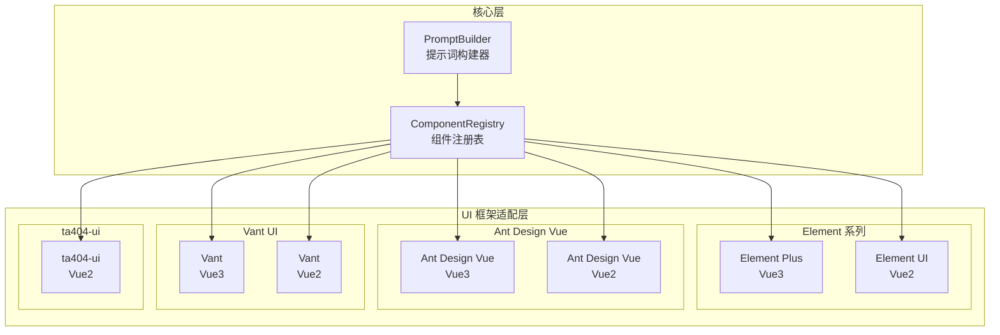
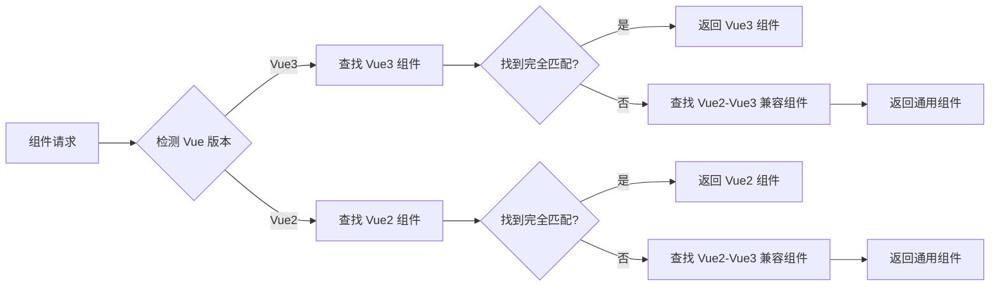
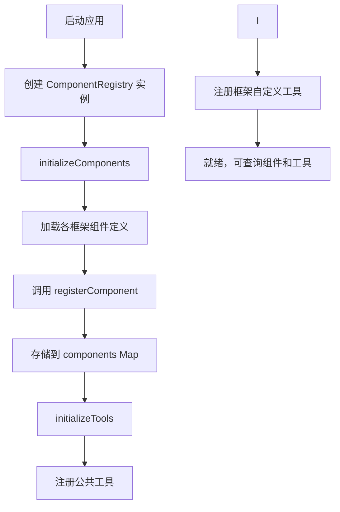

# 组件库架构

## 1. 技术原理

### 1.1 多 UI 框架支持架构

AI Assistant 的核心能力之一是支持多种 Vue UI 框架。为了实现这一目标，系统采用了**抽象层设计**：



### 1.2 组件信息模型

```typescript
interface ComponentInfo {
    type: string;              // 组件类型标识
    label?: string;            // 组件显示名称
    uiFramework: string;       // UI 框架标识
    vueVersion: 'vue2' | 'vue3' | 'common';  // Vue 版本
    category?: ComponentCategory;  // 组件分类
    fieldType?: 'input' | 'layout' | 'date' | 'select' | 'display' | 'assist';
    isField?: boolean;         // 是否为表单字段
    isContainer?: boolean;     // 是否为容器组件
    isAssist?: boolean;        // 是否为辅助组件
    childrenPath?: string;     // 子组件路径
    props?: PropDefinition[];  // 属性定义
    events?: EventDefinition[]; // 事件定义
    examples?: FormField[];    // 使用示例
}

type ComponentCategory = 'form' | 'layout' | 'assist' | 'input' | 'select' | 'date' | 'display';
```

### 1.3 Vue2/Vue3 兼容性处理

系统通过以下策略处理 Vue2 和 Vue3 的兼容性：



## 2. 项目中的实际用例

### 2.1 组件注册表实现

```typescript
// src/core/component-registry.ts
export class ComponentRegistry {
    private components: Map<string, ComponentInfo[]> = new Map();
    private frameworkTools: Map<string, Map<string, ToolRegistration>> = new Map();

    constructor() {
        this.initializeComponents();
        this.initializeTools();
    }

    private initializeComponents() {
        elementPlusComponents.forEach((component: ComponentInfo) => {
            this.registerComponent(component.type, component);
        });
        elementUIComponents.forEach((component: ComponentInfo) => {
            this.registerComponent(component.type, component);
        });
        antDesignVueComponents.forEach((component: ComponentInfo) => {
            this.registerComponent(component.type, component);
        });
        antDesignVue2Components.forEach((component: ComponentInfo) => {
            this.registerComponent(component.type, component);
        });
        vantComponents.forEach((component: ComponentInfo) => {
            this.registerComponent(component.type, component);
        });
        ta404uiVue2Components.forEach((component: ComponentInfo) => {
            this.registerComponent(component.type, component);
        });
    }

    getComponent(
        type: string,
        uiFramework: string,
        vueVersion: 'vue2' | 'vue3' = 'vue3',
    ): ComponentInfo | undefined {
        const components = this.components.get(type);
        if (!components) return undefined;
        const detectedFramework = this.detectFramework(uiFramework, vueVersion);

        // 1. 优先完全匹配
        let component = components.find(
            comp => comp.uiFramework === detectedFramework && comp.vueVersion === vueVersion,
        );

        // 2. 查找兼容组件
        if (!component) {
            component = components.find(
                comp => comp.uiFramework === detectedFramework && comp.vueVersion === 'common',
            );
        }

        // 3. 查找通用组件
        if (!component && detectedFramework !== 'ta404-ui') {
            component = components.find(
                comp => comp.uiFramework === 'common' && comp.vueVersion === 'common',
            );
        }

        return component;
    }

    getComponents(uiFramework: string, vueVersion: 'vue2' | 'vue3' = 'vue3'): ComponentInfo[] {
        const allComponents: ComponentInfo[] = [];
        const detectedFramework = this.detectFramework(uiFramework, vueVersion);
        const shouldIncludeCommon = detectedFramework !== 'ta404-ui';

        for (const components of this.components.values()) {
            const frameworkComponents = components.filter(
                comp =>
                    (comp.uiFramework === detectedFramework || 
                     (shouldIncludeCommon && comp.uiFramework === 'common')) &&
                    (comp.vueVersion === vueVersion || comp.vueVersion === 'common'),
            );
            allComponents.push(...frameworkComponents);
        }

        const uniqueComponents = new Map<string, ComponentInfo>();
        for (const component of allComponents) {
            const key = `${component.uiFramework}-${component.type}`;
            if (!uniqueComponents.has(key) || component.vueVersion !== 'common') {
                uniqueComponents.set(key, component);
            }
        }

        return Array.from(uniqueComponents.values());
    }

    private detectFramework(uiFramework: string, vueVersion: 'vue2' | 'vue3'): string {
        if (uiFramework === 'element-plus') {
            return vueVersion === 'vue2' ? 'element-ui' : 'element-plus';
        }
        if (uiFramework === 'ta404-ui') {
            return 'ta404-ui';
        }
        return uiFramework;
    }
}
```

### 2.2 组件分类实现

```typescript
categorizeComponents(components: ComponentInfo[]) {
    const layoutComponents: ComponentInfo[] = [];
    const inputComponents: ComponentInfo[] = [];
    const selectComponents: ComponentInfo[] = [];
    const dateComponents: ComponentInfo[] = [];
    const formComponents: ComponentInfo[] = [];
    const assistComponents: ComponentInfo[] = [];
    const displayComponents: ComponentInfo[] = [];
    const seenTypes = new Set<string>();

    components.forEach(comp => {
        if (seenTypes.has(comp.type)) return;
        seenTypes.add(comp.type);

        const category = this.getComponentCategory(comp);

        switch (category) {
            case 'input': inputComponents.push(comp); break;
            case 'layout': layoutComponents.push(comp); break;
            case 'date': dateComponents.push(comp); break;
            case 'select': selectComponents.push(comp); break;
            case 'display': displayComponents.push(comp); break;
            case 'form': formComponents.push(comp); break;
            default: assistComponents.push(comp); break;
        }
    });

    return {
        formComponents: { name: '表单组件', description: '用于数据输入、收集和验证的组件', count: formComponents.length, components: formComponents },
        layoutComponents: { name: '容器布局组件', description: '用于页面布局和结构组织的组件', count: layoutComponents.length, components: layoutComponents },
        inputComponents: { name: '输入组件', description: '用于用户录入文本类型的信息的组件', count: inputComponents.length, components: inputComponents },
        selectComponents: { name: '选择组件', description: '用户选择预定义选择项的组件', count: selectComponents.length, components: selectComponents },
        dateComponents: { name: '日期时间组件', description: '用户录入时间类型字段的组件', count: dateComponents.length, components: dateComponents },
        displayComponents: { name: '数据展示组件', description: '主要用于展示数据的组件', count: displayComponents.length, components: displayComponents },
        assistComponents: { name: '辅助组件', description: '提供其他功能的辅助组件', count: assistComponents.length, components: assistComponents },
    };
}

private getComponentCategory(comp: ComponentInfo): ComponentCategory {
    if (comp.category) return comp.category;
    const configCategory = this.getComponentCategoryByType(comp.type, comp.uiFramework);
    if (configCategory) return configCategory;
    if (comp.uiFramework === 'ta404-ui' && comp.fieldType) return comp.fieldType;
    if (comp.isField) return 'form';
    if (comp.isContainer) return 'layout';
    return 'assist';
}
```

### 2.3 Element Plus 组件定义示例

```typescript
// src/components/element-plus/index.ts
export const elementPlusComponents: ComponentInfo[] = [
    {
        type: 'input',
        label: '输入框',
        uiFramework: 'element-plus',
        vueVersion: 'vue3',
        fieldType: 'input',
        isField: true,
        props: [
            { name: 'modelValue', type: 'string', description: '绑定值' },
            { name: 'type', type: 'string', description: '输入框类型', options: ['text', 'textarea', 'password'] },
            { name: 'placeholder', type: 'string', description: '占位文本' },
            { name: 'clearable', type: 'boolean', defaultValue: false, description: '是否可清空' },
            { name: 'disabled', type: 'boolean', defaultValue: false, description: '是否禁用' },
        ],
        events: [
            { name: 'change', description: '值变化时触发' },
            { name: 'blur', description: '失去焦点时触发' },
        ],
    },
    {
        type: 'select',
        label: '下拉选择器',
        uiFramework: 'element-plus',
        vueVersion: 'vue3',
        fieldType: 'select',
        isField: true,
        props: [
            { name: 'modelValue', type: 'string | number | array', description: '绑定值' },
            { name: 'multiple', type: 'boolean', defaultValue: false, description: '是否多选' },
            { name: 'placeholder', type: 'string', description: '占位文本' },
            { name: 'clearable', type: 'boolean', defaultValue: false, description: '是否可清空' },
            { name: 'filterable', type: 'boolean', defaultValue: false, description: '是否可搜索' },
        ],
    },
];
```

### 2.4 框架工具注册

每个 UI 框架可以注册自己特有的工具：

```typescript
// 为 ta404-ui 注册自定义工具
this.registerFrameworkTools('ta404-ui@vue2', ta404uiFormTools);

// 获取工具处理器（优先框架自定义工具）
getToolHandler(name: string, uiFramework?: string) {
    if (uiFramework) {
        const frameworkToolsMap = this.frameworkTools.get(uiFramework);
        if (frameworkToolsMap?.has(name)) {
            return frameworkToolsMap.get(name)?.handler;
        }
    }
    return this.tools.get(name)?.handler;
}
```

## 3. 组件注册与扩展机制

### 3.1 注册流程图



### 3.2 添加新组件示例

```typescript
// 1. 在对应框架文件中添加组件定义
export const myCustomComponents: ComponentInfo[] = [
    {
        type: 'my-custom-input',
        label: '自定义输入框',
        uiFramework: 'element-plus',
        vueVersion: 'vue3',
        fieldType: 'input',
        isField: true,
        props: [
            { name: 'modelValue', type: 'string', description: '绑定值' },
            { name: 'customProp', type: 'string', description: '自定义属性' },
        ],
    },
];

// 2. 在 component-registry.ts 中注册
constructor() {
    this.initializeComponents();
    // 添加新组件
    myCustomComponents.forEach(c => this.registerComponent(c.type, c));
}

// 3. 使用组件
const component = componentRegistry.getComponent('my-custom-input', 'element-plus', 'vue3');
```

### 3.3 组件查询示例

```typescript
// 获取特定框架的所有组件
const components = componentRegistry.getComponents('element-plus', 'vue3');

// 按类型获取组件
const inputComponent = componentRegistry.getComponent('input', 'element-plus', 'vue3');

// 分类展示
const categorized = componentRegistry.categorizeComponents(components);

// 获取提示词
const sections = componentRegistry.getSections(categorized, 'element-plus', 'vue3');
```

## 4. 小结

本节介绍了组件库架构的核心设计：

1. **多框架支持**：统一的 ComponentRegistry 管理所有 UI 框架组件
2. **版本兼容**：智能匹配 Vue2/Vue3 组件，支持回退机制
3. **组件分类**：自动分类为表单、布局、输入、选择、日期等类型
4. **可扩展性**：支持动态注册新组件和工具
5. **框架自定义**：每个框架可注册特有的工具实现

下一章将详细介绍 MCP 工具系统的设计与实现。
