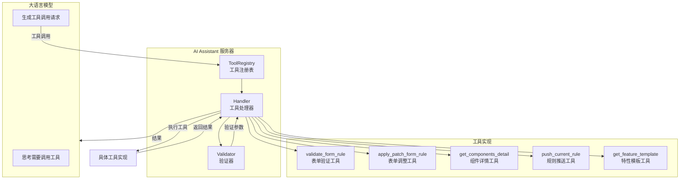
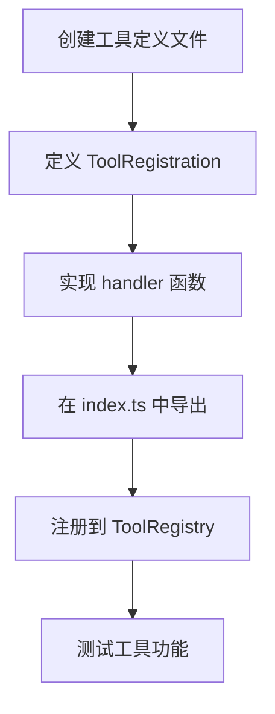
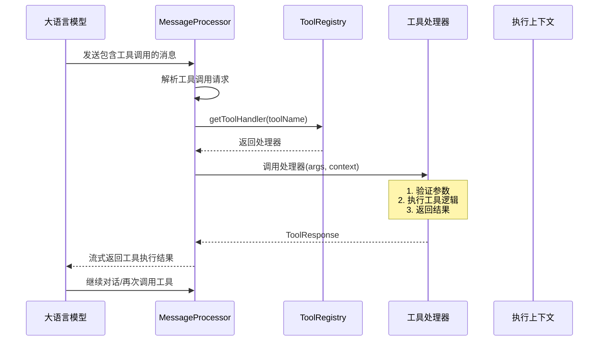

# MCP 工具系统

## 1. 技术原理

### 1.1 MCP 协议概述

MCP (Model Context Protocol) 是一个用于大语言模型与外部工具交互的标准化协议。AI Assistant 使用 MCP SDK 实现工具的定义、注册和调用。

MCP 工具系统的核心设计理念：
- **标准化**：遵循 MCP 协议规范
- **可扩展**：支持动态添加新工具
- **类型安全**：基于 TypeScript 的类型定义

### 1.2 工具调用流程



### 1.3 工具定义模型

```typescript
interface ToolDefinition {
    name: string;           // 工具唯一标识
    title?: string;         // 工具显示名称
    description: string;    // 工具功能描述
    inputSchema: {          // 输入参数Schema
        type: 'object';
        properties: Record<string, SchemaProperty>;
        required?: string[];
    };
    private?: boolean;      // 是否为私有工具
}

interface SchemaProperty {
    type: 'string' | 'number' | 'boolean' | 'array' | 'object';
    description?: string;
    enum?: string[];
    defaultValue?: any;
}

interface ToolRegistration {
    definition: ToolDefinition;
    handler: ToolHandler;
}

type ToolHandler = (args: ToolArgs, context: ToolContext) => Promise<ToolResponse>;
```

## 2. 项目中的实际用例

### 2.1 工具注册表实现

```typescript
// src/service/tools.ts
import type { ToolRegistration, ToolDefinition, ToolHandler } from '../types/index.js';
import { ComponentRegistry } from '../core/component-registry.js';

export class ToolRegistry {
    private componentRegistry: ComponentRegistry;

    constructor(componentRegistry: ComponentRegistry) {
        this.componentRegistry = componentRegistry;
    }

    /**
     * 注册单个工具
     */
    registerTool(registration: ToolRegistration) {
        this.componentRegistry.registerTool(registration);
    }

    /**
     * 批量注册工具
     */
    registerTools(registrations: ToolRegistration[]) {
        registrations.forEach(reg => this.registerTool(reg));
    }

    /**
     * 获取工具处理器
     */
    getToolHandler(name: string, uiFramework?: string): ToolHandler | undefined {
        return this.componentRegistry.getToolHandler(name, uiFramework);
    }

    /**
     * 获取所有工具定义
     */
    getAllToolDefinitions(uiFramework?: string): ToolDefinition[] {
        return this.componentRegistry.getAllToolDefinitions(uiFramework);
    }
}
```

### 2.2 消息处理器中的工具调用

```typescript
// src/service/message-processor.ts
export class MessageProcessor {
    private toolRegistry: ToolRegistry;
    private formGenerator: FormRuleGenerator;
    private componentRegistry: ComponentRegistry;

    /**
     * 动态获取 MCP 工具定义
     */
    async getMCPTools(uiFramework?: string): Promise<AgentTool[]> {
        const mcpTools = this.toolRegistry.getAllToolDefinitions(uiFramework);
        
        // 转换为 Agent 工具格式
        const tools: AgentTool[] = [];
        for (const mcpTool of mcpTools) {
            if (!mcpTool.private) {
                tools.push({
                    type: 'function',
                    function: {
                        name: mcpTool.name,
                        description: mcpTool.description,
                        parameters: {
                            type: 'object',
                            properties: mcpTool.inputSchema?.properties || {},
                            required: mcpTool.inputSchema?.required || [],
                            additionalProperties: false,
                        },
                    },
                });
            }
        }
        
        console.log(`✅ 成功获取 ${tools.length} 个 MCP 工具定义`);
        return tools;
    }

    /**
     * 处理工具调用
     */
    private async handleToolCall(
        toolName: string, 
        arguments_: any, 
        context: Record<string, any>,
        uiFramework?: string
    ): Promise<any> {
        const handler = this.toolRegistry.getToolHandler(toolName, uiFramework);
        if (!handler) {
            throw new Error(`未知的工具: ${toolName}`);
        }

        const result = await handler(arguments_ as ToolArgs, {
            formGenerator: this.formGenerator,
            componentRegistry: this.componentRegistry,
            context,
        });

        return result;
    }
}
```

### 2.3 核心工具实现

#### 2.3.1 表单验证工具

```typescript
// src/components/common/tools/form/handlers/validate-form-rule-tool.ts
import { ToolArgs, ToolContext, ToolRegistration } from '../../../../../types/index.js';
import { createResponse } from '../../../../../utils/index.js';
import { createDetailedValidate } from '../../form-validator.js';

export const validateFormRuleTool: ToolRegistration = {
    definition: {
        name: 'validate_form_rule',
        title: '检查表单规则有效性',
        description: '根据规范校验表单规则，支持全量与增量校验',
        inputSchema: {
            type: 'object',
            properties: {
                sessionId: {
                    type: 'string',
                    description: '会话标识符，用于关联同一会话的多个请求',
                },
                rule: {
                    type: 'array',
                    description: '要校验的组件规则',
                },
                operationType: {
                    type: 'string',
                    enum: ['create', 'modify'],
                    description: '操作类型：create(创建新表单)、modify(修改现有表单)',
                    default: 'create',
                },
                uiFramework: {
                    type: 'string',
                    enum: ['element-plus', 'element-ui', 'ant-design-vue', 'vant', 'ta404-ui'],
                    description: 'UI 框架类型',
                    default: 'element-plus',
                },
            },
            required: ['rule'],
        },
    },
    handler: async (args: ToolArgs, request: ToolContext) => {
        const { operationType, rule, option, sessionId = '', uiFramework } = args || {};

        if (!rule) {
            return createResponse('缺少必需的 rule 参数');
        }

        const formRule: any = { rule };
        formRule.option = option || getDefaultFormOptions();

        // 验证并改进规则
        const validateResult = request.formGenerator.validateRule(
            formRule, 
            uiFramework, 
            request.componentRegistry
        );

        const detailedValidate = createDetailedValidate(
            validateResult, 
            formRule, 
            uiFramework, 
            request.componentRegistry
        );

        if (detailedValidate.isValid) {
            if (operationType === 'create') {
                request.context.newForm = detailedValidate.improvedRule;
            }
            return createResponse(`校验通过:\n\`\`\`json\n${JSON.stringify(detailedValidate.improvedRule, null, 2)}\n\`\`\``);
        } else {
            return createResponse(`表单规则验证发现问题，需要修复：\n\n**需要修复的错误：**\n${detailedValidate.errors.map((e, i) => `${i + 1}. ${e}`).join('\n')}\n\n**修复建议：**\n${detailedValidate.suggestions.map((s, i) => `${i + 1}. ${s}`).join('\n')}`);
        }
    },
};
```

#### 2.3.2 JSON Patch 工具

```typescript
// src/components/common/tools/form/handlers/apply-patch-form-rule-tool.ts
import { ToolArgs, ToolContext, ToolRegistration } from '../../../../../types/index.js';
import { createResponse, removeRulePrefix } from '../../../../../utils/index.js';
import { applyJSONPatch } from '../../../../../core/json-patch-validator.js';
import { createDetailedValidate } from '../../form-validator.js';

export const applyPatchFormRuleTool: ToolRegistration = {
    definition: {
        name: 'apply_patch_form_rule',
        title: '调整表单规则',
        private: true,
        description: '应用JSONPatch补丁，必须全量传入。JSONPatch 操作规范 (RFC 6902)',
        inputSchema: {
            type: 'object',
            properties: {
                sessionId: { type: 'string', description: '会话标识符' },
                summarize: { type: 'string', description: '总结概括本次任务' },
                jsonPatch: {
                    type: 'array',
                    description: 'JSONPatch补丁数组',
                    items: {
                        type: 'object',
                        required: ['op', 'path'],
                        properties: {
                            op: { type: 'string', enum: ['add', 'remove', 'replace', 'move', 'copy', 'test'] },
                            path: { type: 'string', description: 'JSON Pointer路径' },
                            value: { description: '操作值' },
                            from: { type: 'string', description: '源路径' },
                        },
                    },
                },
                uiFramework: { type: 'string', description: 'UI框架类型' },
            },
            required: ['jsonPatch'],
        },
    },
    handler: async (args: ToolArgs, request: ToolContext) => {
        const { uiFramework, summarize } = args || {};
        let jsonPatch = (args.jsonPatch || []).map(patch => ({
            ...patch,
            path: removeRulePrefix(patch.path),
            from: removeRulePrefix(patch.from),
        }));

        if (!jsonPatch || !Array.isArray(jsonPatch)) {
            return createResponse('缺少必需的 jsonPatch 参数');
        }

        // 应用 JSON Patch
        const results = applyJSONPatch(request.context.form.rule, jsonPatch as any);

        // 验证结果
        const validateResult = request.formGenerator.validateRule(
            { rule: results.newDocument },
            uiFramework,
            request.componentRegistry
        );

        const detailedValidate = createDetailedValidate(
            validateResult,
            { rule: results.newDocument },
            uiFramework as string,
            request.componentRegistry
        );

        if (!detailedValidate.isValid) {
            return createResponse(`推送失败，表单规则验证发现问题：\n${detailedValidate.errors.map((e, i) => `${i + 1}. ${e}`).join('\n')}`);
        }
        
        request.context.form = results.newDocument;

        return createResponse(
            '完成执行',
            [`\`\`\`fcRuleDiff\n${JSON.stringify(detailedValidate.improvedRule)}\n\`\`\``, summarize as string],
            true
        );
    },
};
```

#### 2.3.3 组件详情工具

```typescript
// src/components/common/tools/form/handlers/get-components-detail-tool.ts
import { ToolArgs, ToolContext, ToolRegistration } from '../../../../../types/index.js';
import { createResponse } from '../../../../../utils/index.js';

export const getComponentsDetailTool: ToolRegistration = {
    definition: {
        name: 'get_components_detail',
        title: '获取组件详情',
        description: '获取指定类型组件的详细使用说明、属性定义、事件列表和示例代码',
        inputSchema: {
            type: 'object',
            properties: {
                componentName: {
                    type: 'string',
                    description: '组件类型名称，如：input, select, radio',
                },
                uiFramework: {
                    type: 'string',
                    enum: ['element-plus', 'element-ui', 'ant-design-vue', 'vant', 'ta404-ui'],
                },
            },
            required: ['componentName'],
        },
    },
    handler: async (args: ToolArgs, request: ToolContext) => {
        const { componentName, uiFramework } = args || {};
        
        const component = request.componentRegistry.getComponent(
            componentName, 
            uiFramework || 'element-plus'
        );
        
        if (!component) {
            return createResponse(`未找到组件: ${componentName}`);
        }
        
        return createResponse(`组件详情：\n\`\`\`json\n${JSON.stringify(component, null, 2)}\n\`\`\``);
    },
};
```

## 3. 如何添加新工具

### 3.1 添加新工具的步骤



### 3.2 工具模板示例

```typescript
// src/components/common/tools/form/handlers/my-custom-tool.ts
import { ToolArgs, ToolContext, ToolRegistration } from '../../../../../types/index.js';
import { createResponse } from '../../../../../utils/index.js';

export const myCustomTool: ToolRegistration = {
    definition: {
        name: 'my_custom_tool',
        title: '我的自定义工具',
        description: '描述工具的功能和用途',
        inputSchema: {
            type: 'object',
            properties: {
                param1: { type: 'string', description: '参数1说明' },
                param2: { type: 'number', description: '参数2说明' },
            },
            required: ['param1'],
        },
    },
    handler: async (args: ToolArgs, request: ToolContext) => {
        const { param1, param2 } = args || {};
        
        // 工具逻辑实现
        const result = await doSomething(param1, param2);
        
        return createResponse(`操作结果: ${result}`);
    },
};
```

### 3.3 注册新工具

```typescript
// src/components/common/tools/form/index.ts
import { myCustomTool } from './handlers/my-custom-tool.js';

export const formTools = [
    validateFormRuleTool,
    pushCurrentRuleTool,
    getComponentsDetailTool,
    applyPatchFormRuleTool,
    getFeatureTemplateTool,
    myCustomTool,  // 添加新工具
];
```

### 3.4 框架自定义工具示例

```typescript
// src/components/ta404-ui/tools/form/index.ts
import { ta404uiSpecialTool } from './handlers/ta404ui-special-tool.js';

export const ta404uiFormTools = [
    ta404uiSpecialTool,
    // ... 其他 ta404-ui 特有工具
];
```

## 4. 工具调用流程图



## 5. 小结

本节介绍了 MCP 工具系统的设计与实现：

1. **协议遵循**：基于 MCP SDK 实现标准化工具接口
2. **工具注册**：统一的 ToolRegistry 管理所有工具
3. **框架扩展**：支持为特定 UI 框架注册自定义工具
4. **核心工具**：包括表单验证、JSON Patch、组件详情等
5. **易于扩展**：按模板添加新工具，快速扩展功能

下一章将详细介绍表单生成流程。
