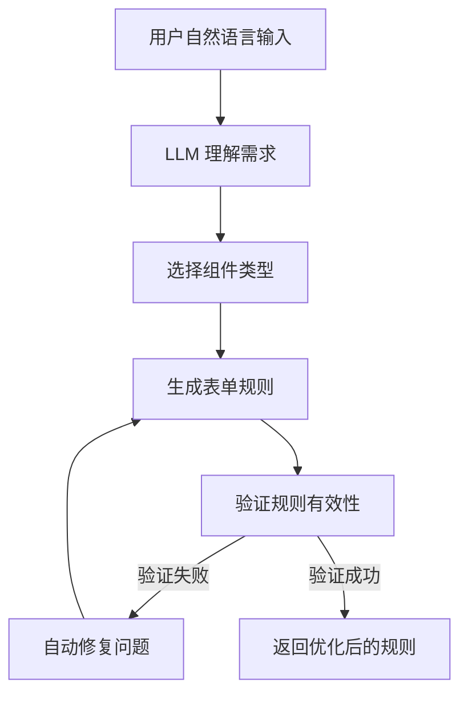
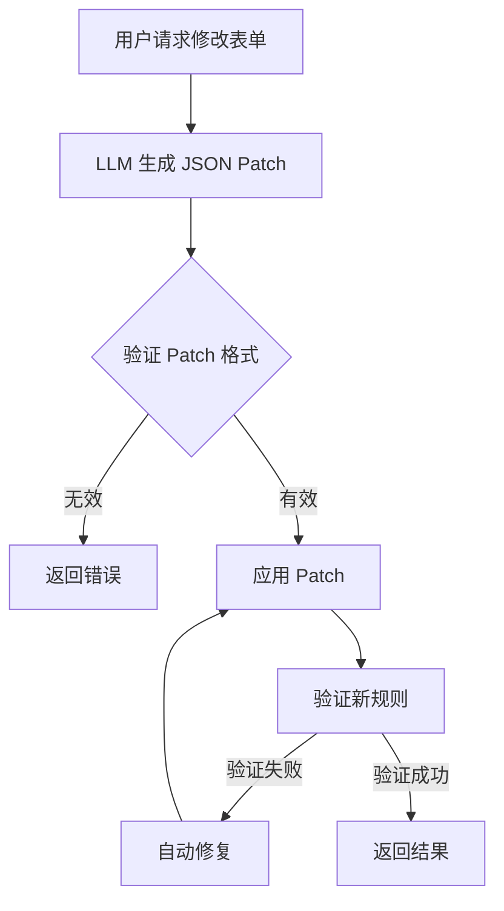
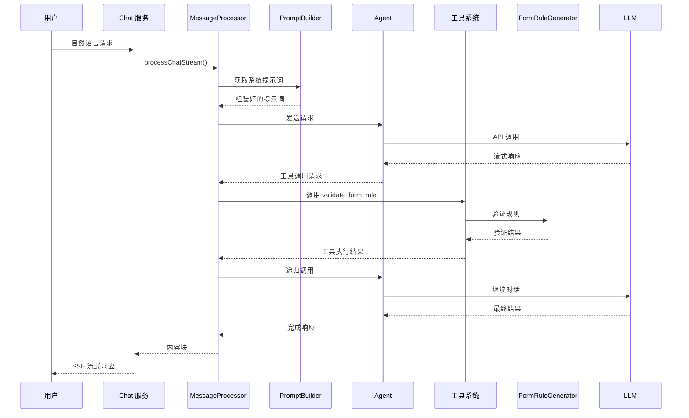
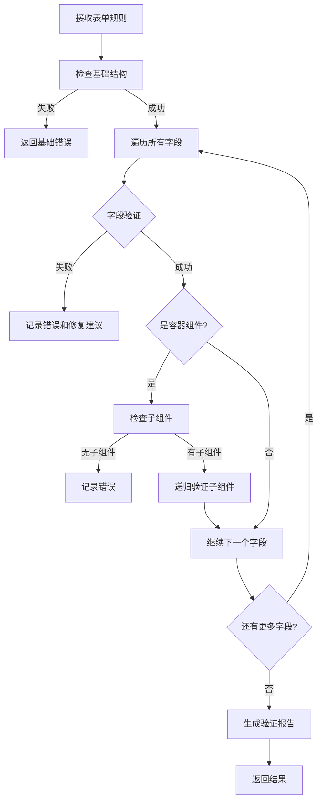

# 表单生成流程

## 1. 技术原理

### 1.1 自然语言到表单规则的转换

AI Assistant 的核心功能是将用户的自然语言描述转换为符合规范的表单规则。这个过程涉及：

1. **意图理解**：LLM 理解用户的表单需求
2. **组件选择**：根据需求选择合适的组件
3. **规则生成**：生成 form-create 格式的规则
4. **验证优化**：验证规则正确性并自动修复

### 1.2 转换流程概述



### 1.3 表单规则数据结构

```typescript
interface FormRule {
    rule: FormField[];      // 表单字段规则
    option?: Record<string, any>; // 表单配置选项
}

interface FormField {
    type: string;           // 组件类型
    field?: string;         // 字段名
    title?: string;         // 字段标题
    name?: string;          // 显示名称
    props?: Record<string, any>;     // 组件属性
    validate?: ValidateRule[];        // 验证规则
    children?: FormField[] | string[]; // 子组件
    [key: string]: any;
}

interface ValidateRule {
    required?: boolean;
    type?: string;
    message: string;
    trigger?: string;
}
```

## 2. 项目中的实际用例

### 2.1 表单规则生成器

```typescript
// src/core/form-rule-generator.ts
export class FormRuleGenerator {
    private componentRegistry: ComponentRegistry;

    constructor(componentRegistry?: ComponentRegistry) {
        this.componentRegistry = componentRegistry || new ComponentRegistry();
    }

    /**
     * 验证并改进表单规则
     * 合并了验证和自动推断功能
     */
    validateRule(
        rule: any,
        uiFramework: string = 'element-plus',
        componentRegistry?: any,
    ): ValidateAndImproveResult {
        const errors: string[] = [];
        const warnings: string[] = [];
        const suggestions: string[] = [];

        // 基础验证
        if (!rule || typeof rule !== 'object') {
            errors.push('规则必须是一个对象');
            return { isValid: false, errors, warnings, suggestions };
        }

        if (!rule.rule || !Array.isArray(rule.rule)) {
            errors.push('规则必须包含 rule 数组');
            return { isValid: false, errors, warnings, suggestions };
        }

        // 创建改进后的规则副本
        const improvedRule: FormRule = {
            ...rule,
            rule: JSON.parse(JSON.stringify(rule.rule)),
        };

        // 递归验证每个字段
        const validateAndImproveField = (field: FormField, index: number, path: string = '') => {
            if (typeof field === 'string') return;

            const fieldPath = path ? `${path}.rule[${index}]` : `$.rule[${index}]`;

            // 调用框架特定的验证器
            const validatorMap = this.componentRegistry.getValidators(uiFramework);
            if (validatorMap) {
                const validator = validatorMap[field.type];
                if (validator) {
                    const result = validator(field);
                    if (!result.isValid) {
                        errors.push(...result.errors.map(e => `${fieldPath} ${e}`));
                    }
                }
            } else {
                // 默认验证逻辑
                if (!field.props) {
                    field.props = {};
                } else {
                    // 迁移 formCreate 前缀的属性
                    Object.keys(field.props).forEach(key => {
                        let flag = false;
                        if (key === 'formCreateChild' && typeof field.props?.[key] === 'string') {
                            field.children = [field.props[key]];
                            flag = true;
                        } else if (key.indexOf('formCreate') === 0 || key.indexOf('>') > 0) {
                            let path = key;
                            if (path.indexOf('formCreate') === 0) {
                                path = path.replace('formCreate', '');
                                path = path.replace(path[0], path[0].toLowerCase());
                            } else {
                                path = `props>${key}`;
                            }
                            this.setValueByPath(field, path.replace('>', '.'), field.props?.[key]);
                            flag = true;
                        }
                        if (flag) {
                            delete field.props?.[key];
                        }
                    });
                }

                // 必需字段验证
                if (!field.type) {
                    errors.push(`${fieldPath} 缺少 type 属性`);
                    suggestions.push(`为 ${fieldPath} 添加 type 属性，例如: "input", "select" 等`);
                    return;
                }

                // 检查组件是否存在
                let component = componentRegistry?.getComponent(field.type, uiFramework);
                if (!component && field._fc_drag_tag) {
                    component = componentRegistry?.getComponent(field._fc_drag_tag, uiFramework);
                    if (component) {
                        field.type = component.examples[0].type;
                    }
                }

                // 容器组件验证
                const isContainer = this.isContainerComponent(field, componentRegistry, uiFramework);
                const childrenPath = component?.childrenPath || 'children';
                const children = this.getValueByPath(field, childrenPath);

                if (isContainer && (!children || !Array.isArray(children) || children.length === 0)) {
                    errors.push(`${fieldPath} 是容器组件，必须包含 ${childrenPath} 属性`);
                    suggestions.push(`为 ${fieldPath} 添加 ${childrenPath} 属性，包含子组件数组`);
                }

                // 递归验证子组件
                if (children && Array.isArray(children)) {
                    children.forEach((child: FormField, childIndex: number) => {
                        const childPath = `${fieldPath}.${childrenPath}[${childIndex}]`;
                        validateAndImproveField(child, childIndex, childPath);
                    });
                }
            }
        };

        improvedRule.rule.forEach((field: FormField, index: number) => {
            validateAndImproveField(field, index);
        });

        return {
            isValid: errors.length === 0,
            errors: [...new Set(errors)],
            warnings: [...new Set(warnings)],
            suggestions: [...new Set(suggestions)],
            improvedRule,
        };
    }

    /**
     * 根据路径设置值
     */
    private setValueByPath(obj: any, path: string, value: any): void {
        if (!path) return;
        const keys = path.split('.');
        let current = obj;
        for (let i = 0; i < keys.length - 1; i++) {
            const key = keys[i];
            if (!current[key] || typeof current[key] !== 'object') {
                current[key] = {};
            }
            current = current[key];
        }
        current[keys[keys.length - 1]] = value;
    }

    /**
     * 根据路径获取值
     */
    private getValueByPath(obj: any, path: string): any {
        if (!path || !obj) return undefined;
        const keys = path.split('.');
        let current = obj;
        for (const key of keys) {
            if (current == null || typeof current !== 'object') {
                return undefined;
            }
            current = current[key];
        }
        return current;
    }

    private isContainerComponent(field: FormField, componentRegistry?: any, uiFramework?: string): boolean {
        const CONTAINER_COMPONENT_TYPES = ['fcRow', 'col', 'group'];
        return (
            CONTAINER_COMPONENT_TYPES.includes(field.type as any) ||
            componentRegistry?.getComponent(field.type, uiFramework)?.isContainer === true
        );
    }
}
```

### 2.2 JSON Patch 应用

系统使用 RFC 6902 JSON Patch 标准进行增量更新：

```typescript
// src/core/json-patch-validator.ts
import { applyPatch, validateOperation } from 'fast-json-patch';

export interface JSONPatchResult {
    newDocument: any;
    testResults: any[];
}

export function applyJSONPatch(document: any, patch: any[]): JSONPatchResult {
    // 验证 Patch 操作
    for (const operation of patch) {
        const error = validateOperation(operation);
        if (error) {
            throw new Error(`无效的 Patch 操作: ${error.message}`);
        }
    }

    // 应用 Patch
    const result = applyPatch(document, patch, true, false);
    
    return {
        newDocument: result.newDocument,
        testResults: result.testResults,
    };
}
```

### 2.3 增量更新流程



### 2.4 表单验证工具集成

```typescript
// src/components/common/tools/form/handlers/validate-form-rule-tool.ts
import { createDetailedValidate } from '../../form-validator.js';

export const validateFormRuleTool: ToolRegistration = {
    definition: {
        name: 'validate_form_rule',
        title: '检查表单规则有效性',
        description: '根据规范校验表单规则，输出错误、警告、修复建议与优化后的规则',
        inputSchema: {
            type: 'object',
            properties: {
                sessionId: { type: 'string', description: '会话标识符' },
                rule: { type: 'array', description: '要校验的组件规则' },
                operationType: { type: 'string', enum: ['create', 'modify'], description: '操作类型' },
                uiFramework: { type: 'string', description: 'UI 框架类型' },
            },
            required: ['rule'],
        },
    },
    handler: async (args: ToolArgs, request: ToolContext) => {
        const { operationType, rule, option, uiFramework } = args || {};
        
        const formRule: any = { rule, option: option || getDefaultFormOptions() };
        
        // 调用验证器
        const validateResult = request.formGenerator.validateRule(
            formRule, 
            uiFramework, 
            request.componentRegistry
        );
        
        const detailedValidate = createDetailedValidate(
            validateResult, 
            formRule, 
            uiFramework, 
            request.componentRegistry
        );

        if (detailedValidate.isValid) {
            return createResponse(`校验通过:\n\`\`\`json\n${JSON.stringify(detailedValidate.improvedRule, null, 2)}\n\`\`\``);
        } else {
            return createResponse(`表单规则验证发现问题，需要修复：\n\n**错误：**\n${detailedValidate.errors.map((e, i) => `${i + 1}. ${e}`).join('\n')}\n\n**建议：**\n${detailedValidate.suggestions.map((s, i) => `${i + 1}. ${s}`).join('\n')}`);
        }
    },
};
```

### 2.5 提示词构建器

```typescript
// src/service/prompt-builder.ts
export class PromptBuilder {
    private componentRegistry: ComponentRegistry;

    constructor(componentRegistry: ComponentRegistry) {
        this.componentRegistry = componentRegistry;
    }

    /**
     * 构建增强的系统提示词
     */
    buildEnhancedSystemPrompt(
        sessionId: string,
        version: { ui: string; vue: 'vue2' | 'vue3' },
        formRule?: any,
    ): string {
        const systemPrompt = this.readSystemPrompt(version);
        const sessionInfo = this.buildSessionInfo(sessionId, version.ui, version.vue);
        const components = this.componentRegistry.getComponents(version.ui, version.vue);
        const categorizedComponents = this.componentRegistry.categorizeComponents(components);
        const componentList = this.buildComponentList(categorizedComponents, version);
        const userRule = this.buildUserRule(formRule);

        return `${systemPrompt}\n${sessionInfo}\n${componentList}\n${userRule}`;
    }

    /**
     * 构建会话信息
     */
    private buildSessionInfo(sessionId: string, ui: string, vueVersion: string): string {
        return `<session_id readonly>${sessionId}</session_id>
<ui readonly>${ui}</ui>
<vue_version readonly>${vueVersion}</vue_version>`;
    }

    /**
     * 构建用户现有规则
     */
    private buildUserRule(formRule: any): string {
        if (!formRule) return '';
        return `\n<current_user_rule>\n${JSON.stringify(formRule)}\n</current_user_rule>`;
    }
}
```

## 3. 完整流程图



## 4. 表单验证与修复机制

### 4.1 验证流程



### 4.2 自动修复策略

系统支持以下自动修复策略：

1. **属性迁移**：自动将 `formCreate` 前缀的属性迁移到正确位置
2. **默认值填充**：为缺少必需属性的组件填充默认值
3. **组件类型推断**：根据上下文推断缺失的组件类型
4. **层级修复**：自动补全容器组件的子组件

```typescript
// 自动修复示例
if (!field.type) {
    // 根据 field 名称推断组件类型
    if (field.field?.includes('date')) {
        field.type = 'date-picker';
    } else if (field.field?.includes('select')) {
        field.type = 'select';
    } else {
        field.type = 'input';
    }
}

if (!field.field && !isAssist) {
    // 自动生成 field 名称
    field.field = field.title?.toLowerCase().replace(/\s+/g, '_') || `field_${Date.now()}`;
}
```

## 5. 小结

本节介绍了表单生成流程的核心设计：

1. **自然语言理解**：LLM 解析用户需求并生成表单规则
2. **规则验证**：多层次的验证机制确保规则正确性
3. **增量更新**：基于 JSON Patch 实现高效的局部修改
4. **自动修复**：智能推断和自动补全减少人工干预
5. **框架适配**：支持多种 UI 框架的规则转换

下一章将详细介绍 API 接口文档。
