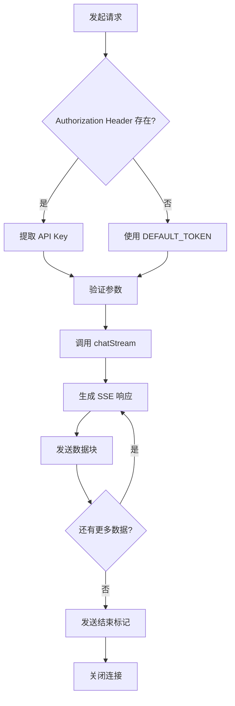
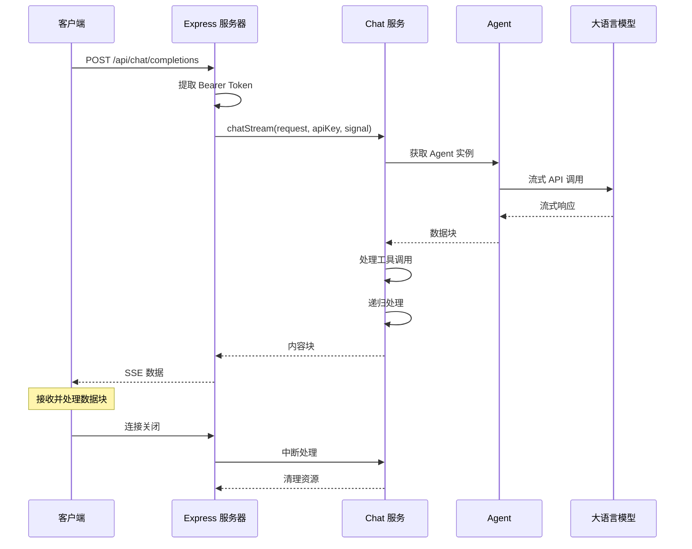

# API 接口文档

## 1. 接口概述

AI Assistant 提供 OpenAI 兼容的 Chat Completions API，支持流式和非流式两种调用方式。所有接口均遵循 RESTful 规范，返回标准化的错误格式。

### 1.1 接口基础信息

| 属性 | 值 |
|------|-----|
| 基础路径 | `/api` |
| 版本 | v1 |
| 认证方式 | Bearer Token |
| 响应格式 | JSON (SSE 流式) |
| 超时时间 | 180秒（可配置） |

## 2. Chat Completions 接口

### 2.1 接口定义

```
POST /api/chat/completions
Content-Type: application/json
Authorization: Bearer {API_KEY}
```

### 2.2 请求格式

```typescript
interface ChatRequest {
    // 必需：模型名称
    model: string;
    
    // 必需：UI 框架类型
    ui: string;
    
    // 必需：消息列表
    messages: OpenAIMessage[];
    
    // 可选：Agent 类型（默认: deepseek）
    agent?: 'deepseek' | 'dify' | 'qwen' | 'zhipu' | 'other';
    
    // 可选：Agent 消息类型（默认: openai）
    agentMessageType?: 'openai' | 'dify';
    
    // 可选：表单上下文
    form?: {
        rule?: string;  // 现有表单规则 JSON 字符串
        option?: string; // 表单配置选项
    };
    
    // 可选：自定义上下文
    context?: Record<string, any>;
    
    // 可选：会话 ID
    conversation_id?: string;
}

interface OpenAIMessage {
    role: 'system' | 'user' | 'assistant' | 'tool';
    content: string;
    tool_call_id?: string;
    tool_calls?: Array<{
        id: string;
        type: 'function';
        function: {
            name: string;
            arguments: string;
        };
    }>;
}
```

### 2.3 请求示例

**cURL 请求示例：**
```bash
curl -X POST http://localhost:3001/api/chat/completions \
  -H "Content-Type: application/json" \
  -H "Authorization: Bearer your-api-key" \
  -d '{
    "model": "deepseek-chat",
    "ui": "element-plus",
    "messages": [
      {
        "role": "user",
        "content": "创建一个用户注册表单，包含用户名、邮箱和密码字段"
      }
    ]
  }'
```

**JavaScript 请求示例：**
```javascript
const response = await fetch('http://localhost:3001/api/chat/completions', {
    method: 'POST',
    headers: {
        'Content-Type': 'application/json',
        'Authorization': 'Bearer your-api-key',
    },
    body: JSON.stringify({
        model: 'deepseek-chat',
        ui: 'element-plus',
        agent: 'deepseek',
        messages: [
            {
                role: 'user',
                content: '创建一个用户注册表单，包含用户名、邮箱和密码字段'
            }
        ]
    })
});

// 处理流式响应
const reader = response.body.getReader();
const decoder = new TextDecoder();

while (true) {
    const { done, value } = await reader.read();
    if (done) break;
    
    const chunk = decoder.decode(value);
    console.log(chunk);
}
```

### 2.4 响应格式

#### 2.4.1 流式响应 (SSE)

```typescript
interface OpenAIChatStreamChunk {
    id: string;                    // 响应 ID
    object: 'formCreateAgent';     // 对象类型
    created: number;               // 创建时间戳
    model?: string;                // 模型名称
    usage?: null | Object;         // Token 使用统计
    choices: Array<{
        index: number;             // 选择索引
        delta: {
            role?: 'assistant';    // 角色
            content?: string;      // 内容
        };
        finish_reason: 'stop' | 'length' | 'function_call' | 'content_filter' | null;
    }>;
}
```

**流式响应示例：**
```
data: {"id":"chatcmpl-1704067200-abc123","object":"formCreateAgent","created":1704067200,"choices":[{"index":0,"delta":{"role":"assistant"},"finish_reason":null}]}

data: {"id":"chatcmpl-1704067200-abc123","object":"formCreateAgent","created":1704067200,"choices":[{"index":0,"delta":{"content":"我"},"finish_reason":null}]}

data: {"id":"chatcmpl-1704067200-abc123","object":"formCreateAgent","created":1704067200,"choices":[{"index":0,"delta":{"content":"将"},"finish_reason":null}]}

data: {"id":"chatcmpl-1704067200-abc123","object":"formCreateAgent","created":1704067200,"choices":[{"index":0,"delta":{"content":"为您"},"finish_reason":null}]}

data: {"id":"chatcmpl-1704067200-abc123","object":"formCreateAgent","created":1704067200,"choices":[{"index":0,"delta":{},"finish_reason":"stop"}]}

data: [DONE]
```

#### 2.4.2 工具调用标记

系统会在工具调用时输出特殊标记：

```typescript
// 工具开始执行
[FC_TOOL]{"title":"检查表单规则有效性","id":"tc_123","status":"loading"}

// 工具执行完成
[FC_TOOL]{"title":"检查表单规则有效性","id":"tc_123","status":"end"}
```

### 2.5 响应处理流程图



## 3. 错误处理

### 3.1 错误响应格式

所有错误均遵循 OpenAI 错误格式：

```typescript
interface ErrorResponse {
    error: {
        message: string;       // 错误信息
        type: string;          // 错误类型
        code: string;          // 错误码
        param?: string;        // 相关参数
    };
}
```

### 3.2 HTTP 状态码

| 状态码 | 说明 | 处理建议 |
|--------|------|----------|
| 200 | 请求成功 | 正常处理响应 |
| 400 | 请求参数错误 | 检查请求参数 |
| 401 | 认证失败 | 检查 API Key |
| 403 | 访问被拒绝 | 检查权限设置 |
| 404 | 接口不存在 | 检查请求路径 |
| 429 | 请求频率限制 | 稍后重试 |
| 500 | 服务器内部错误 | 联系技术支持 |
| 502/503/504 | 服务不可用 | 稍后重试 |

### 3.3 错误处理示例

```typescript
// 请求失败时的错误响应
{
    "error": {
        "message": "API 认证失败 (401): 请检查 API 密钥是否正确",
        "type": "authentication_error",
        "code": "invalid_api_key"
    }
}

// 参数错误
{
    "error": {
        "message": "缺少必需的 rule 参数",
        "type": "invalid_request_error",
        "code": "missing_required_parameter"
    }
}

// 服务器错误
{
    "error": {
        "message": "Internal server error",
        "type": "server_error",
        "code": "internal_server_error"
    }
}
```

### 3.4 错误处理代码示例

```javascript
async function chatWithAI(request) {
    try {
        const response = await fetch('http://localhost:3001/api/chat/completions', {
            method: 'POST',
            headers: {
                'Content-Type': 'application/json',
                'Authorization': `Bearer ${API_KEY}`,
            },
            body: JSON.stringify(request),
        });

        if (!response.ok) {
            const error = await response.json();
            throw new Error(error.error.message);
        }

        // 处理流式响应
        const reader = response.body.getReader();
        const decoder = new TextDecoder();
        
        while (true) {
            const { done, value } = await reader.read();
            if (done) break;
            
            const text = decoder.decode(value);
            // 解析 SSE 数据...
        }
    } catch (error) {
        if (error.message.includes('401')) {
            console.error('API 认证失败，请检查密钥');
        } else if (error.message.includes('429')) {
            console.error('请求频率限制，请稍后重试');
        } else {
            console.error('请求失败:', error.message);
        }
    }
}
```

## 4. 健康检查接口

### 4.1 接口定义

```
GET /api/health
```

### 4.2 响应示例

```json
{
    "success": true,
    "message": "AI 助手 聊天服务正常运行",
    "timestamp": "2024-01-01T12:00:00.000Z"
}
```

## 5. 支持的 UI 框架

| ui 参数值 | Vue 版本 | 框架名称 |
|-----------|----------|----------|
| `element-plus` | Vue 3 | Element Plus |
| `element-ui` | Vue 2 | Element UI |
| `ant-design-vue` | Vue 3 | Ant Design Vue |
| `ant-design-vue@vue2` | Vue 2 | Ant Design Vue |
| `vant` | Vue 3 | Vant UI |
| `vant@vue2` | Vue 2 | Vant UI |
| `ta404-ui@vue2` | Vue 2 | ta404-ui |

## 6. 支持的 Agent 类型

| agent 参数值 | 说明 | 默认模型 |
|--------------|------|----------|
| `deepseek` | DeepSeek API | deepseek-chat |
| `dify` | Dify 平台 | - |
| `qwen` | 通义千问 | qwen-turbo |
| `zhipu` | 智谱 AI | glm-4 |
| `other` | 自定义 OpenAI 兼容接口 | - |

## 7. 完整请求流程图



## 8. 小结

本节介绍了 API 接口的完整规范：

1. **OpenAI 兼容**：遵循 Chat Completions API 规范
2. **流式响应**：使用 SSE 协议实现实时输出
3. **标准化错误**：统一的错误格式便于处理
4. **多 Agent 支持**：通过 `agent` 参数切换不同模型
5. **工具调用标记**：通过特殊标记指示工具执行状态

下一章将介绍部署指南。
