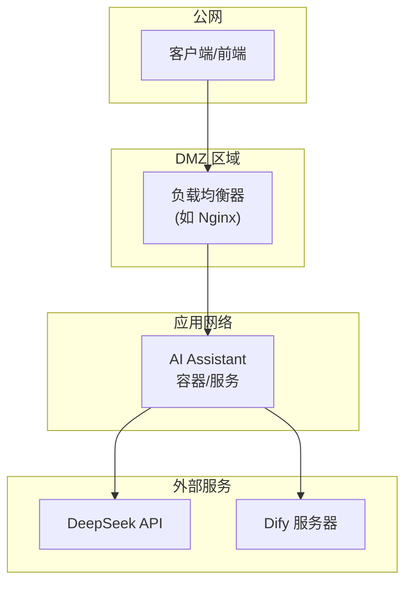

# 部署指南

## 1. 概述

AI Assistant 支持多种部署方式，包括 Docker 容器化部署和本地直接运行。本节将详细介绍完整的部署流程、配置选项和运维注意事项。

## 2. Docker 部署

### 2.1 准备环境

确保目标服务器已安装以下软件：
- Docker Engine 20.10+
- Docker Compose 2.0+ (可选)

### 2.2 构建 Docker 镜像

```bash
# 进入项目目录
cd ai-assistant

# 构建镜像
docker build -t ai-assistant:latest .

# 或者使用 docker-compose
docker-compose build
```

### 2.3 Dockerfile 详解

```dockerfile
# 使用官方 Node.js 运行时
FROM node:18-alpine

WORKDIR /app

# 安装 pnpm 并配置镜像
RUN npm config set registry https://registry.npmmirror.com && \
    npm install -g pnpm && \
    pnpm config set fetch-timeout 300000 && \
    pnpm config set fetch-retries 5

# 复制依赖文件
COPY package.json pnpm-lock.yaml* ./

# 安装依赖
RUN pnpm install

# 复制源代码
COPY src ./src
COPY tsconfig.json ./

# 构建项目
RUN npm run build

# 复制提示词文件到 dist 目录
RUN mkdir -p dist/components/common/prompts && \
    mkdir -p dist/components/ta404-ui/prompts && \
    cp src/components/common/prompts/*.md dist/components/common/prompts/ && \
    cp src/components/ta404-ui/prompts/*.md dist/components/ta404-ui/prompts/

# 清理生产环境不需要的依赖
RUN pnpm prune --prod

# 创建 .env 文件
RUN echo "AGENT_API=http://192.168.20.91:8022/v1/chat/completions" > .env

# 暴露端口
EXPOSE 3001

# 创建非 root 用户
RUN addgroup -g 1001 -S nodejs && \
    adduser -S nodejs -u 1001 && \
    chown -R nodejs:nodejs /app

USER nodejs

# 启动应用
CMD ["node", "dist/service/index.js"]
```

### 2.4 docker-compose.yml 示例

```yaml
version: '3.8'

services:
  ai-assistant:
    build: .
    container_name: ai-assistant
    ports:
      - "3001:3001"
    environment:
      - PORT=3001
      - AGENT_API=${AGENT_API:-https://api.deepseek.com/v1/chat/completions}
      - AGENT_TIMEOUT=180000
      - DEFAULT_AGENT=deepseek
      - DEFAULT_MODEL=deepseek-chat
      - DEFAULT_TOKEN=${DEFAULT_TOKEN}
      - FORM_CREATE_BUSINESS=${FORM_CREATE_BUSINESS:-false}
    restart: unless-stopped
    healthcheck:
      test: ["CMD", "wget", "-q", "--spider", "http://localhost:3001/api/health"]
      interval: 30s
      timeout: 10s
      retries: 3
    volumes:
      - ./logs:/app/logs
```

### 2.5 启动容器

```bash
# 使用 docker-compose 启动
docker-compose up -d

# 或使用 docker 命令
docker run -d \
  --name ai-assistant \
  -p 3001:3001 \
  -e AGENT_API=https://api.deepseek.com/v1/chat/completions \
  -e DEFAULT_TOKEN=your-api-key \
  ai-assistant:latest
```

## 3. 本地运行

### 3.1 环境要求

- Node.js 18+
- pnpm (推荐) 或 npm

### 3.2 安装依赖

```bash
# 安装依赖
pnpm install

# 或使用 npm
npm install
```

### 3.3 配置环境变量

```bash
# 复制环境变量模板
cp .env.example .env

# 编辑配置文件
vim .env
```

### 3.4 启动服务

```bash
# 开发模式运行（使用 tsx）
pnpm start

# 生产模式运行（需要先构建）
pnpm build
pnpm start:build
```

## 4. 环境变量配置

### 4.1 完整配置项

```bash
# ============================================
# 服务器配置
# ============================================

# 服务端口 (默认: 3001)
PORT=3001

# ============================================
# Agent API 配置
# ============================================

# OpenAI 兼容接口的完整 URL
AGENT_API=https://api.deepseek.com/v1/chat/completions

# API 请求超时时间（毫秒）
AGENT_TIMEOUT=180000

# ============================================
# 默认 Agent 设置
# ============================================

# Agent Key 类型: dify | openai
DEFAULT_AGENT_KEY_TYPE=openai

# 默认 Agent 类型: deepseek | dify | qwen | zhipu | other
DEFAULT_AGENT=deepseek

# 默认模型名称
DEFAULT_MODEL=deepseek-chat

# 默认 API Token（配置后可省略请求头传递）
DEFAULT_TOKEN=fc-xxxxxxxxxxxxxxxxxx

# ============================================
# 功能开关
# ============================================

# 是否为 FormCreate 设计器高级版
FORM_CREATE_BUSINESS=false
```

### 4.2 配置说明

| 变量 | 必填 | 说明 |
|------|------|------|
| `PORT` | 否 | 服务端口，默认 3001 |
| `AGENT_API` | 否 | 自定义 API 端点 |
| `AGENT_TIMEOUT` | 否 | 请求超时，默认 180000ms |
| `DEFAULT_AGENT` | 否 | 默认 Agent 类型 |
| `DEFAULT_MODEL` | 否 | 默认模型名称 |
| `DEFAULT_TOKEN` | 否 | 默认 API 密钥 |
| `FORM_CREATE_BUSINESS` | 否 | 高级版组件开关 |

### 4.3 不同 Agent 配置示例

**DeepSeek (默认):**
```bash
AGENT_API=https://api.deepseek.com/v1/chat/completions
DEFAULT_AGENT=deepseek
DEFAULT_MODEL=deepseek-chat
```

**Dify:**
```bash
# Dify API 地址
DIFY_API_URL=http://your-dify-server/v1
# Dify 应用 API Key
DEFAULT_TOKEN=app-xxxxxxxxxxxx
# 使用 dify Agent
DEFAULT_AGENT=dify
```

**自定义 OpenAI 兼容接口:**
```bash
AGENT_API=https://api.openai.com/v1/chat/completions
DEFAULT_AGENT=other
DEFAULT_MODEL=gpt-4
```

## 5. 部署架构图



## 6. 运维注意事项

### 6.1 日志管理

```bash
# 查看容器日志
docker logs ai-assistant

# 实时查看日志
docker logs -f ai-assistant

# 查看最近 100 行日志
docker logs --tail 100 ai-assistant
```

### 6.2 健康检查

```bash
# HTTP 健康检查
curl http://localhost:3001/api/health

# 预期响应
# {"success":true,"message":"AI 助手 聊天服务正常运行","timestamp":"..."}
```

### 6.3 性能监控

```bash
# 查看容器资源使用
docker stats ai-assistant

# 查看容器进程
docker top ai-assistant
```

### 6.4 备份与恢复

```bash
# 备份配置
cp .env .env.backup

# 恢复配置
cp .env.backup .env
```

### 6.5 更新部署

```bash
# 使用 docker-compose 更新
docker-compose down
docker-compose build --no-cache
docker-compose up -d

# 或使用 docker 命令
docker stop ai-assistant
docker rm ai-assistant
docker build -t ai-assistant:latest .
docker run -d --name ai-assistant -p 3001:3001 ai-assistant:latest
```

### 6.6 故障排查

| 问题 | 可能原因 | 解决方案 |
|------|----------|----------|
| 服务无法启动 | 端口被占用 | 检查 3001 端口，或修改 PORT |
| API 调用失败 | 网络问题 | 检查 AGENT_API 配置 |
| 认证失败 | Token 无效 | 检查 DEFAULT_TOKEN 或请求头 |
| 内存不足 | 并发过高 | 增加容器内存限制 |

### 6.7 安全建议

1. **API 密钥保护**：不要在代码中硬编码密钥，使用环境变量
2. **网络隔离**：限制服务暴露的端口
3. **定期更新**：及时更新依赖和基础镜像
4. **日志脱敏**：日志中不要记录完整的 API 密钥

```typescript
// 日志中脱敏 API 密钥
console.log('🔑 使用 API 密钥:', apiKey ? `${apiKey.substring(0, 10)}...` : '未提供');
```

### 6.8 资源限制

```yaml
# docker-compose.yml 中的资源限制
services:
  ai-assistant:
    deploy:
      resources:
        limits:
          cpus: '2'
          memory: 2G
        reservations:
          cpus: '0.5'
          memory: 512M
```

## 7. 小结

本节介绍了完整的部署指南：

1. **Docker 部署**：详细的 Dockerfile 和 docker-compose 配置
2. **本地运行**：开发环境的快速启动方式
3. **环境变量**：所有可配置项的详细说明
4. **运维管理**：日志、健康检查、监控等
5. **故障排查**：常见问题和解决方案

下一章将介绍前端面板的使用说明。
