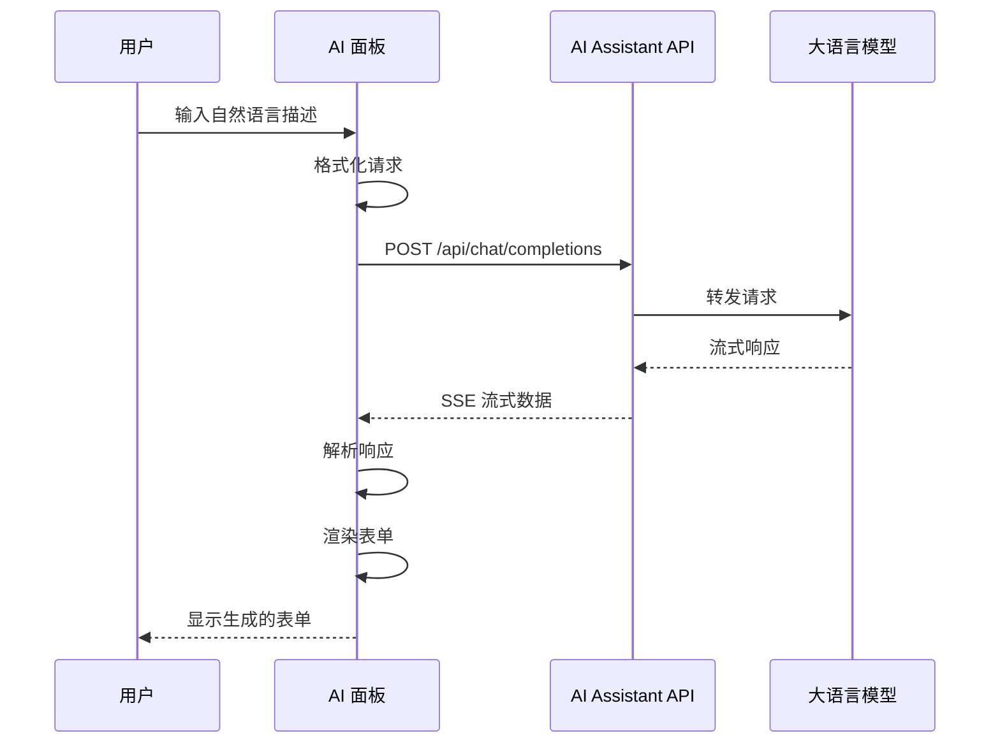

# 前端面板说明

## 1. 概述

AI Assistant 前端面板是 form-create 设计器的 AI 增强组件，它将 AI 能力集成到表单设计器中，使用户能够通过自然语言描述来创建和修改表单。本节将介绍面板的集成方式、配置参数和使用示例。

## 2. 集成方式

### 2.1 通过 npm 安装

```bash
# 安装 ai-panel 包
npm install @form-create/ai-panel
```

### 2.2 在 Vue 项目中注册

```javascript
// main.js 或 main.ts
import { createApp } from 'vue';
import FormCreate from '@form-create/element-ui';
import AiPanel from '@form-create/ai-panel';
import App from './App.vue';

const app = createApp(App);

app.use(FormCreate);
app.use(AiPanel);

app.mount('#app');
```

### 2.3 在设计器中使用

```vue
<template>
  <fc-designer ref="designer" />
</template>

<script setup>
import { ref, onMounted } from 'vue';

const designer = ref(null);

onMounted(() => {
  // 获取设计器实例
  const d = designer.value.getDesigner();
  
  // 启用 AI 面板
  d.use(AiPanel, {
    api: 'http://localhost:3001/api/chat/completions',
  });
});
</script>
```

## 3. 配置参数

### 3.1 完整配置项

```typescript
interface AiPanelConfig {
    // 必需：API 地址
    api: string;
    
    // 可选：API 密钥
    apiKey?: string;
    
    // 可选：默认 UI 框架
    uiFramework?: string;
    
    // 可选：Vue 版本
    vueVersion?: 'vue2' | 'vue3';
    
    // 可选：显示模式
    mode?: 'panel' | 'dialog' | 'inline';
    
    // 可选：自动提交
    autoSubmit?: boolean;
    
    // 可选：最大对话历史
    maxHistory?: number;
    
    // 可选：占位符文本
    placeholder?: string;
    
    // 可选：快捷指令
    quickActions?: QuickAction[];
    
    // 可选：自定义提示词
    customPrompt?: string;
}

interface QuickAction {
    label: string;
    prompt: string;
    icon?: string;
}
```

### 3.2 配置示例

```javascript
const aiPanelConfig = {
    api: 'http://localhost:3001/api/chat/completions',
    apiKey: 'your-api-key',
    uiFramework: 'element-plus',
    vueVersion: 'vue3',
    mode: 'panel',
    autoSubmit: false,
    maxHistory: 10,
    placeholder: '描述您需要的表单...',
    quickActions: [
        {
            label: '创建登录表单',
            prompt: '创建一个登录表单，包含用户名和密码字段',
            icon: 'user'
        },
        {
            label: '创建注册表单',
            prompt: '创建一个用户注册表单',
            icon: 'add-user'
        },
        {
            label: '创建联系表单',
            prompt: '创建一个联系表单，包含姓名、邮箱、电话和留言字段',
            icon: 'message'
        }
    ]
};
```

### 3.3 不同 UI 框架配置

**Element Plus:**
```javascript
{
    api: 'http://localhost:3001/api/chat/completions',
    uiFramework: 'element-plus',
    vueVersion: 'vue3'
}
```

**Ant Design Vue:**
```javascript
{
    api: 'http://localhost:3001/api/chat/completions',
    uiFramework: 'ant-design-vue',
    vueVersion: 'vue3'
}
```

**Vant:**
```javascript
{
    api: 'http://localhost:3001/api/chat/completions',
    uiFramework: 'vant',
    vueVersion: 'vue3'
}
```

**ta404-ui:**
```javascript
{
    api: 'http://localhost:3001/api/chat/completions',
    uiFramework: 'ta404-ui',
    vueVersion: 'vue2'
}
```

## 4. 使用示例

### 4.1 基础使用

```vue
<template>
  <div>
    <fc-designer ref="designer" />
  </div>
</template>

<script setup>
import { ref, onMounted } from 'vue';
import AiPanel from '@form-create/ai-panel';

const designer = ref(null);

onMounted(() => {
  const d = designer.value.getDesigner();
  
  d.use(AiPanel, {
    api: 'http://localhost:3001/api/chat/completions',
    uiFramework: 'element-plus',
    vueVersion: 'vue3'
  });
});
</script>
```

### 4.2 带认证的请求

```javascript
d.use(AiPanel, {
    api: 'http://localhost:3001/api/chat/completions',
    apiKey: 'Bearer sk-your-api-key',
    uiFramework: 'element-plus'
});
```

### 4.3 带快捷指令的配置

```javascript
d.use(AiPanel, {
    api: 'http://localhost:3001/api/chat/completions',
    uiFramework: 'element-plus',
    quickActions: [
        {
            label: '📝 简单表单',
            prompt: '创建一个简单的表单，包含姓名和邮箱字段'
        },
        {
            label: '🔐 登录表单',
            prompt: '创建一个登录表单，包含用户名、密码字段，以及记住我选项'
        },
        {
            label: '📋 详细信息表单',
            prompt: '创建一个详细信息表单，包含基本信息、联系方式、工作经历等部分'
        }
    ]
});
```

### 4.4 处理生成结果

```javascript
d.use(AiPanel, {
    api: 'http://localhost:3001/api/chat/completions',
    on生成成功(formRule) {
        console.log('表单规则生成成功:', formRule);
        // 可以在这里进行后续处理
        d.append(formRule.rule);
    },
    on生成失败(error) {
        console.error('表单规则生成失败:', error);
    }
});
```

## 5. 与后端通信流程

### 5.1 请求流程图



### 5.2 请求数据格式

```javascript
{
    model: 'deepseek-chat',
    ui: 'element-plus',
    agent: 'deepseek',
    agentMessageType: 'openai',
    messages: [
        {
            role: 'user',
            content: '创建一个用户注册表单，包含用户名、邮箱和密码'
        }
    ],
    context: {
        form: {
            rule: '[]'  // 如果有现有规则
        }
    }
}
```

### 5.3 响应数据处理

```javascript
// 解析 SSE 响应
async function handleStreamResponse(response) {
    const reader = response.body.getReader();
    const decoder = new TextDecoder();
    
    let buffer = '';
    
    while (true) {
        const { done, value } = await reader.read();
        if (done) break;
        
        buffer += decoder.decode(value);
        const lines = buffer.split('\n');
        buffer = lines.pop() || '';
        
        for (const line of lines) {
            if (line.startsWith('data: ')) {
                const data = line.slice(6);
                if (data === '[DONE]') continue;
                
                try {
                    const chunk = JSON.parse(data);
                    const content = chunk.choices[0]?.delta?.content;
                    if (content) {
                        // 处理内容
                        console.log(content);
                    }
                } catch (e) {
                    // 忽略解析错误
                }
            }
        }
    }
}
```

## 6. 常见问题

### 6.1 面板不显示

**检查项：**
1. API 地址是否正确
2. 服务是否正常运行
3. 浏览器控制台是否有错误

```javascript
// 调试配置
d.use(AiPanel, {
    api: 'http://localhost:3001/api/chat/completions',
    debug: true  // 开启调试模式
});
```

### 6.2 请求超时

```javascript
// 增加超时时间
d.use(AiPanel, {
    api: 'http://localhost:3001/api/chat/completions',
    timeout: 60000  // 60秒
});
```

### 6.3 CORS 错误

确保后端服务正确配置了 CORS：

```javascript
// 后端 Express 配置
app.use(cors({
    origin: true,
    methods: ['GET', 'POST', 'PUT', 'DELETE', 'OPTIONS'],
    allowedHeaders: ['Content-Type', 'Authorization']
}));
```

### 6.4 生成结果不符合预期

**优化建议：**
1. 提供更详细的需求描述
2. 使用快捷指令模板
3. 调整系统提示词

```javascript
d.use(AiPanel, {
    api: 'http://localhost:3001/api/chat/completions',
    customPrompt: `你是一个专业的表单设计助手...
    请根据用户需求生成符合规范的表单规则。`
});
```

## 7. 高级用法

### 7.1 自定义工具注册

```javascript
d.use(AiPanel, {
    api: 'http://localhost:3001/api/chat/completions',
    tools: [
        {
            name: 'my_custom_tool',
            description: '自定义工具说明',
            parameters: {
                type: 'object',
                properties: {
                    param1: { type: 'string', description: '参数1' }
                },
                required: ['param1']
            }
        }
    ]
});
```

### 7.2 事件监听

```javascript
d.use(AiPanel, {
    api: 'http://localhost:3001/api/chat/completions',
    
    // 监听事件
    onShow: () => console.log('面板显示'),
    onHide: () => console.log('面板隐藏'),
    onSubmit: (content) => console.log('提交内容:', content),
    on生成成功: (formRule) => {
        console.log('生成成功:', formRule);
        // 可以添加自定义处理逻辑
    },
    on生成失败: (error) => {
        console.error('生成失败:', error);
    },
    onTokenUsage: (usage) => {
        console.log('Token 使用:', usage);
    }
});
```

### 7.3 国际化支持

```javascript
d.use(AiPanel, {
    api: 'http://localhost:3001/api/chat/completions',
    locale: {
        placeholder: '请描述您需要的表单...',
        submit: '生成表单',
        loading: '正在生成...',
        success: '生成成功',
        error: '生成失败',
        quickActions: {
            title: '快捷指令'
        }
    }
});
```

## 8. 小结

本节介绍了前端面板的完整使用指南：

1. **集成方式**：通过 npm 安装并注册到 Vue 应用
2. **配置参数**：详细的配置选项说明
3. **使用示例**：基础使用、认证、快捷指令等场景
4. **通信流程**：与后端 API 的交互方式
5. **常见问题**：调试方法和解决方案
6. **高级用法**：自定义工具、事件监听、国际化

通过本指南，您应该能够成功将 AI Assistant 集成到 form-create 设计器中，并充分利用其 AI 能力来加速表单开发。
